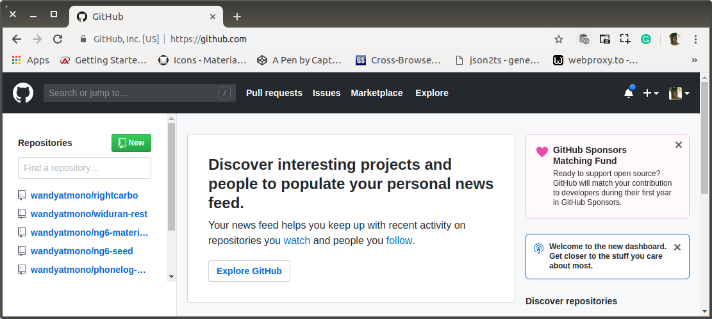
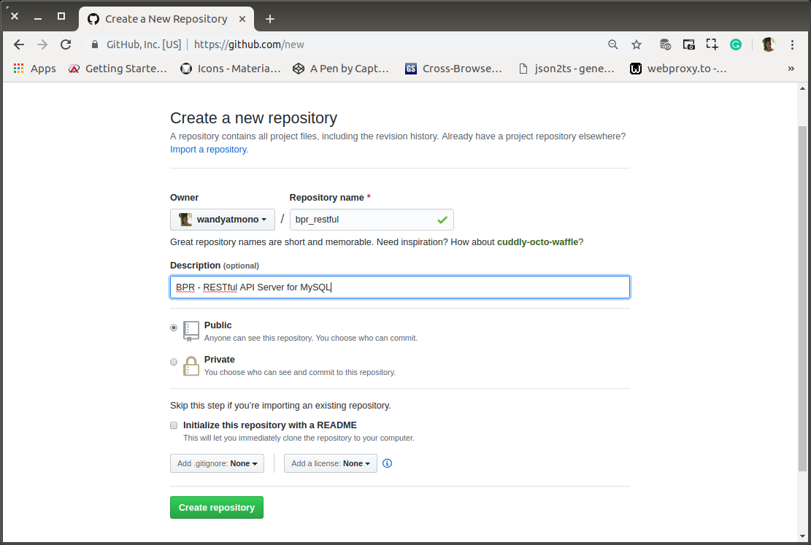
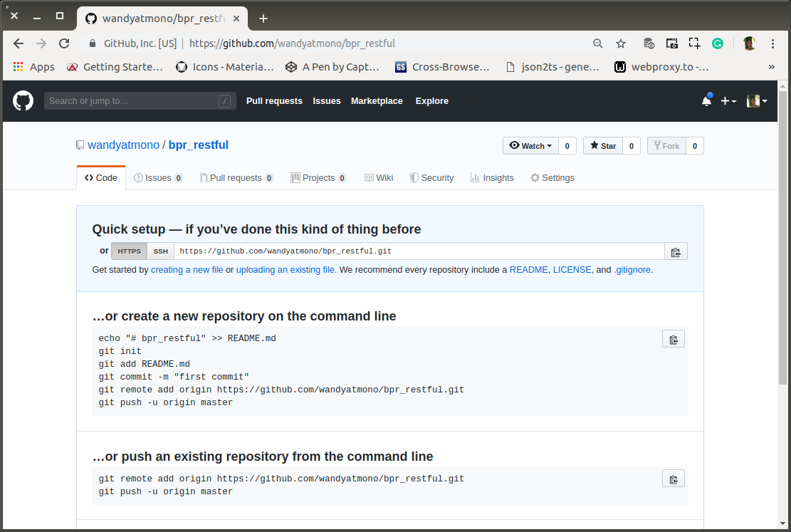

# aa-01-learn-begin.md

`Minggu, 14 Juli 2019`

**`12:19`**

## Remote Repository

Remote repository yang saya gunakan adalah Github. 

0. Create New

    Setelah signin ke https://github.com/wandyatmono, langsung create new.

    <p align="center">
        
        <br />Figure: aa-03-a-create-new.png
    </p>

1. Name, Description, Public, No README.md

    <p align="center">
        
        <br />Figure: aa-03-b-form.png
    </p>

2. Done

    <p align="center">
        
        <br />Figure: aa-03-c-done.png
    </p>

**`12:39`**

## RESTful API Node JS + Express + MySQL (Read)

0. Membuat direktori proyek baru untuk RESTful API Server

    ```bash
    $ cd projects/bpr
    $ mkdir restful
    $ cd restful
    ```

1. Project Init

    ```bash
    $ npm init
    ```

    `package.json`

    ```json
    {
        "name": "restful",
        "version": "0.0.0",
        "description": "BPR - RESTful API Server for MySQL",
        "main": "index.js",
        "directories": {
            "doc": "docs"
        },
        "scripts": {
            "test": "echo \"Error: no test specified\" && exit 1"
        },
        "keywords": [
            "BPR",
            "restfull"
        ],
        "author": "Joko Wandyatmono",
        "license": "MIT"
    }
    ```

3. Install `express`, `mysql` dan `body-parser`

    ```bash
    $ sudo npm install --save express mysql body-parser
    [sudo] password for wandyatmono: 
    npm notice created a lockfile as package-lock.json. You should commit this file.
    npm WARN restful@0.0.0 No repository field.

    + mysql@2.17.1
    + body-parser@1.19.0
    + express@4.17.1
    added 59 packages from 48 contributors and audited 171 packages in 14.116s
    found 0 vulnerabilities
    ```

**`12:46`**

## Preparation for Git And Push to Git

0. Git Version

    ```bash
    $ git --version
    git version 1.9.1
    ```

1. Global Config

    ```bash
    $ git config --global user.name "wandyatmono"
    $ git config --global user.email emond.swd@gmail.com
    $ git config --list
    user.name=wandyatmono
    user.email=emond.swd@gmail.com
    ```

2. Prepare a file for README.

    Saya mengambil default style yang ada di https://github.com/RichardLitt/standard-readme/blob/master/README.md dan saya letakkan di root directory.


3. Git Init

    ```bash
    $ git init .
    Initialized empty Git repository in /home/wandyatmono/projects/bpr/restful/.git/

    $ git status
    On branch master

    Initial commit

    Untracked files:
    (use "git add <file>..." to include in what will be committed)

        README.md
        docs/
        node_modules/
        package-lock.json
        package.json

    nothing added to commit but untracked files present (use "git add" to track)
    ```

4. First Revision

    ```bash
    $ git add .
    wandyatmono@ubuntu-devenvo:~/projects/bpr/restful$ git status
    $ git status
    On branch master

    Initial commit

    Changes to be committed:
    (use "git rm --cached <file>..." to unstage)

        new file:   README.md
        new file:   docs/aa-00-devenvo.md
        new file:   docs/aa-01-devenvo-check.md
        new file:   docs/aa-02-devenvo-mysql.md
        new file:   docs/aa-03-devenvo-project-init.md
        new file:   docs/aa-04-devenvo-repository.md
        new file:   docs/figures/aa-03-a-create-new.png
        new file:   docs/figures/aa-03-b-form.png
        new file:   docs/figures/aa-03-c-done.png
        new file:   node_modules/.bin/mime
        new file:   node_modules/accepts/HISTORY.md
        new file:   node_modules/accepts/LICENSE
        new file:   node_modules/accepts/README.md
        new file:   node_modules/accepts/index.js
        ...
        new file:   package-lock.json
    	new file:   package.json
    ```

    Saya lupa untuk mengecualikan `node_modules`

    ```bash
    $ git commit -m "first commit"
    $ git remote add origin https://github.com/wandyatmono/bpr_restful.git
    ```

4. Push

    ```bash
    git push -u origin master
    ```
**`04:36`**

TODO

Pembentukan dabase NANTI

3. Schemma

    ```bash
    CREATE SCHEMA `bpr` ;
    ```

4. `users` table

    `bpr.users`

    ```sql
    DROP TABLE IF EXISTS `users`;
    CREATE TABLE `users` (
        `id` int(11) NOT NULL AUTO_INCREMENT,
        `name` varchar(64) COLLATE utf8_unicode_ci DEFAULT NULL,
        `account` varchar(256) CHARACTER SET utf8 DEFAULT NULL,
        `password` varchar(256) CHARACTER SET utf8 DEFAULT NULL,
        `role` varchar(2) CHARACTER SET utf8 DEFAULT NULL,
        `ric` varchar(16) CHARACTER SET utf8 DEFAULT NULL,
        `bank_acc` varchar(45) COLLATE utf8_unicode_ci DEFAULT NULL,
        `birth_place` varchar(45) COLLATE utf8_unicode_ci DEFAULT NULL,
        `birth_date` date DEFAULT NULL,
        `gender` tinyint(1) DEFAULT NULL,
        `notifications` int(11) DEFAULT NULL,
        `chats` varchar(45) COLLATE utf8_unicode_ci DEFAULT NULL,
        PRIMARY KEY (`id`)
    ) ENGINE=InnoDB AUTO_INCREMENT=13 DEFAULT CHARSET=utf8 COLLATE=utf8_unicode_ci;
    ```

5. Insert data pengujian

    ```sql
    LOCK TABLES `users` WRITE;
    /*!40000 ALTER TABLE `users` DISABLE KEYS */;
    INSERT INTO `users` VALUES (1,'Freddy Paloh','51eeed7251f3f56288ee554afaa1028b7fbc3daacc4a952be4ae8d18ddaf3320','51eeed7251f3f56288ee554afaa1028b7fbc3daacc4a952be4ae8d18ddaf3320','2','1234567890123456','12345678901234','Bogor','1970-10-15',1,2345,'12'),(2,'Lani Husadawati','41d2b587f0f0497acd9f17293d22f45f54bc5f0726a3f3d4edf426fe384c11dd','41d2b587f0f0497acd9f17293d22f45f54bc5f0726a3f3d4edf426fe384c11dd','30','1234567890123456','12345678901234','Solo','1986-08-17',0,12,'564'),(3,'Wongso Hermanto','c85ad879e6f75b0b4b51de83450e5530bfd3fab85cc67418d2251f134f0ef92c','c85ad879e6f75b0b4b51de83450e5530bfd3fab85cc67418d2251f134f0ef92c','0','1234567890123456','12345678901234','Solo','1970-10-15',1,656,'0'),(4,'Yusnita Sri Sundari','e28bc14ef7ee01d17147dd302d552645fa7f4df30b05349c8b4099494475cd10','e28bc14ef7ee01d17147dd302d552645fa7f4df30b05349c8b4099494475cd10','31','1234567890123456','12345678901234','Sukoharjo','1990-04-28',0,0,'45'),(5,'Andi Pratiknyo','180348f5b22db17be014d5c1cb8151c858267cb44819e5460a7ae2528b91680e','180348f5b22db17be014d5c1cb8151c858267cb44819e5460a7ae2528b91680e','30','1234567890123456','12345678901234','Tangerang','1970-07-25',1,34,'4'),(6,'Atika Shubert','7d8aa9ea7dfe7be0112d05cc946364aa9334f45ba30fbbe9e376a4bdb85a1964','7d8aa9ea7dfe7be0112d05cc946364aa9334f45ba30fbbe9e376a4bdb85a1964','31','1234567890123456','12345678901234','Klaten','1981-02-13',1,2,'8'),(7,'Perkuat Akseina','c5957d4541f993f63104a756d2a8aa3fa360582b9e4379f38a4297fe815a9c69','c5957d4541f993f63104a756d2a8aa3fa360582b9e4379f38a4297fe815a9c69','42','1234567890123456','12345678901234','Malang','1981-07-17',0,17,'20'),(8,'Pracoyo Sejati Leno','043a43fa0703d0af5d80d84db2bd455c4eb9836e0ad34cc70ea3f451f04d6b16','043a43fa0703d0af5d80d84db2bd455c4eb9836e0ad34cc70ea3f451f04d6b16','41','1234567890123456','12345678901234','Solo','1980-06-12',0,0,'2'),(9,'Puji Kaesthi','8c87f6ec99f742cf462a8c121dbdae4a48fb666cbb002094f6572cd6c1adb951','8c87f6ec99f742cf462a8c121dbdae4a48fb666cbb002094f6572cd6c1adb951','40','1234567890123456','12345678901234','Solo','1986-01-27',1,2,'4'),(10,'Putri Rimba Manangsang','997af0fb6c844069db0e17d37b90e4e44314c5a84c2187f35ca4e45f82e66d59','997af0fb6c844069db0e17d37b90e4e44314c5a84c2187f35ca4e45f82e66d59','40','1234567890123456','12345678901234','Mataram','1987-09-10',1,23,'0'),(11,'Sopan Sumangkir','b2865123894a3ed061c3546de26914a00a1595a88254a993e98a47d67e41879e','b2865123894a3ed061c3546de26914a00a1595a88254a993e98a47d67e41879e','51','1234567890123456','12345678901234','Sibolga','1979-08-17',0,1,'1'),(12,'Urip Wanodyo Sejati','c7691d57aae84ccae80f8209a90e9f97170ade0d93559399105eb0db9b21a906','c7691d57aae84ccae80f8209a90e9f97170ade0d93559399105eb0db9b21a906','31','1234567890123456','12345678901234','Yogya','1987-03-02',1,22,'0');
    /*!40000 ALTER TABLE `users` ENABLE KEYS */;
    UNLOCK TABLES;
    ```

**`19:32`**

