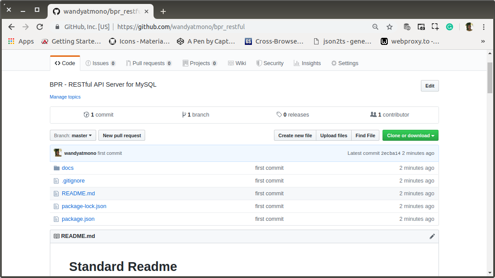

# aa-01-learn-begin.md

`Minggu, 14 Juli 2019`

**`12:19`**

## Remote Repository

Remote repository yang saya gunakan adalah Github. 

0. Create New

    Setelah signin ke https://github.com/wandyatmono, langsung create new.

    <p align="center">
        
        <br />Figure: aa-03-a-create-new.png
    </p>

1. Name, Description, Public, No README.md

    <p align="center">
        
        <br />Figure: aa-03-b-form.png
    </p>

2. Done

    <p align="center">
        
        <br />Figure: aa-03-c-done.png
    </p>

**`12:39`**

## RESTful API Node JS + Express + MySQL (Read)

0. Membuat direktori proyek baru untuk RESTful API Server

    ```bash
    $ cd projects/bpr
    $ mkdir restful
    $ cd restful
    ```

1. Project Init

    ```bash
    $ npm init
    ```

    `package.json`

    ```json
    {
        "name": "restful",
        "version": "0.0.0",
        "description": "BPR - RESTful API Server for MySQL",
        "main": "index.js",
        "directories": {
            "doc": "docs"
        },
        "scripts": {
            "test": "echo \"Error: no test specified\" && exit 1"
        },
        "keywords": [
            "BPR",
            "restfull"
        ],
        "author": "Joko Wandyatmono",
        "license": "MIT"
    }
    ```

3. Install `express`, `mysql` dan `body-parser`

    ```bash
    $ sudo npm install --save express mysql body-parser
    [sudo] password for wandyatmono: 
    npm notice created a lockfile as package-lock.json. You should commit this file.
    npm WARN restful@0.0.0 No repository field.

    + mysql@2.17.1
    + body-parser@1.19.0
    + express@4.17.1
    added 59 packages from 48 contributors and audited 171 packages in 14.116s
    found 0 vulnerabilities
    ```

## Preparation for Git And Push to Git

0. Git Version

    ```bash
    $ git --version
    git version 1.9.1
    ```

1. Global Config

    ```bash
    $ git config --global user.name "wandyatmono"
    $ git config --global user.email emond.swd@gmail.com
    $ git config --list
    user.name=wandyatmono
    user.email=emond.swd@gmail.com
    ```

2. Prepare a file for README.

    Saya mengambil default style yang ada di https://github.com/RichardLitt/standard-readme/blob/master/README.md dan saya letakkan di root directory.


3. Git Init

    ```bash
    $ git init .
    Initialized empty Git repository in /home/wandyatmono/projects/bpr/restful/.git/

    $ git status
    On branch master

    Initial commit

    Untracked files:
    (use "git add <file>..." to include in what will be committed)

        README.md
        docs/
        node_modules/
        package-lock.json
        package.json

    nothing added to commit but untracked files present (use "git add" to track)
    ```

## First Revision

0. Stage

    ```bash
    $ git add .
    wandyatmono@ubuntu-devenvo:~/projects/bpr/restful$ git status
    $ git status
    On branch master

    Initial commit

    Changes to be committed:
    (use "git rm --cached <file>..." to unstage)

        new file:   README.md
        new file:   docs/aa-00-devenvo.md
        new file:   docs/aa-01-devenvo-check.md
        new file:   docs/aa-02-devenvo-mysql.md
        new file:   docs/aa-03-devenvo-project-init.md
        new file:   docs/aa-04-devenvo-repository.md
        new file:   docs/figures/aa-03-a-create-new.png
        new file:   docs/figures/aa-03-b-form.png
        new file:   docs/figures/aa-03-c-done.png
        new file:   node_modules/.bin/mime
        new file:   node_modules/accepts/HISTORY.md
        new file:   node_modules/accepts/LICENSE
        new file:   node_modules/accepts/README.md
        new file:   node_modules/accepts/index.js
        ...
        new file:   package-lock.json
    	new file:   package.json
    ```

    Saya lupa untuk mengecualikan `node_modules`

    ```bash
    $ git rm -r --cached node_modules/
    $ touch .gitignore
    $ echo "/node_modules" > .gitignore
    $ git add .
    wandyatmono@ubuntu-devenvo:~/projects/bpr/restful$ git status
    On branch master

    Initial commit

    Changes to be committed:
    (use "git rm --cached <file>..." to unstage)

        new file:   .gitignore
        new file:   README.md
        new file:   docs/aa-00-devenvo.md
        new file:   docs/aa-01-devenvo-check.md
        new file:   docs/aa-02-devenvo-mysql.md
        new file:   docs/aa-03-devenvo-project-init.md
        new file:   docs/aa-04-devenvo-repository.md
        new file:   docs/figures/aa-03-a-create-new.png
        new file:   docs/figures/aa-03-b-form.png
        new file:   docs/figures/aa-03-c-done.png
        new file:   package-lock.json
        new file:   package.json
    ```

1. First Commit

    ```bash
    $ git commit -m "first commit"
    $ git remote add origin https://github.com/wandyatmono/bpr_restful.git
    ```

2. Push

    ```bash
    $ git push -u origin master
    Username for 'https://github.com': wandyatmono
    Password for 'https://wandyatmono@github.com': 
    Counting objects: 16, done.
    Delta compression using up to 2 threads.
    Compressing objects: 100% (14/14), done.
    Writing objects: 100% (16/16), 308.18 KiB | 0 bytes/s, done.
    Total 16 (delta 0), reused 0 (delta 0)
    To https://github.com/wandyatmono/bpr_restful.git
    * [new branch]      master -> master
    Branch master set up to track remote branch master from origin.
    ```

**`14:39`**

3. Github Check

    <p align="center">
        
        <br />Figure: aa-03-d-on-github.png
    </p>

## Second Commit

Saya sudah melakukan commit saat dokumentasi sedang ditulis. Oleh karena itu dokumentasi ini akan saya benahi dibagian akhirnya. 

Hasil editing akan ikut di-commit pada kali commit yang kedua.

**`14:55`**