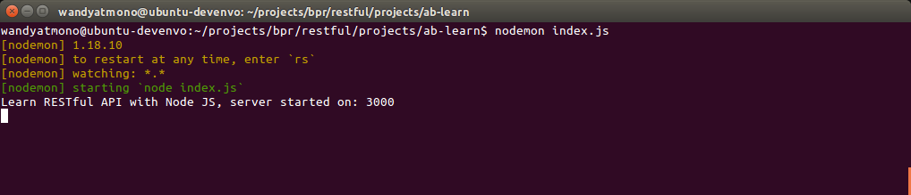
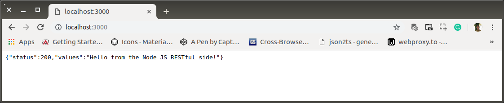
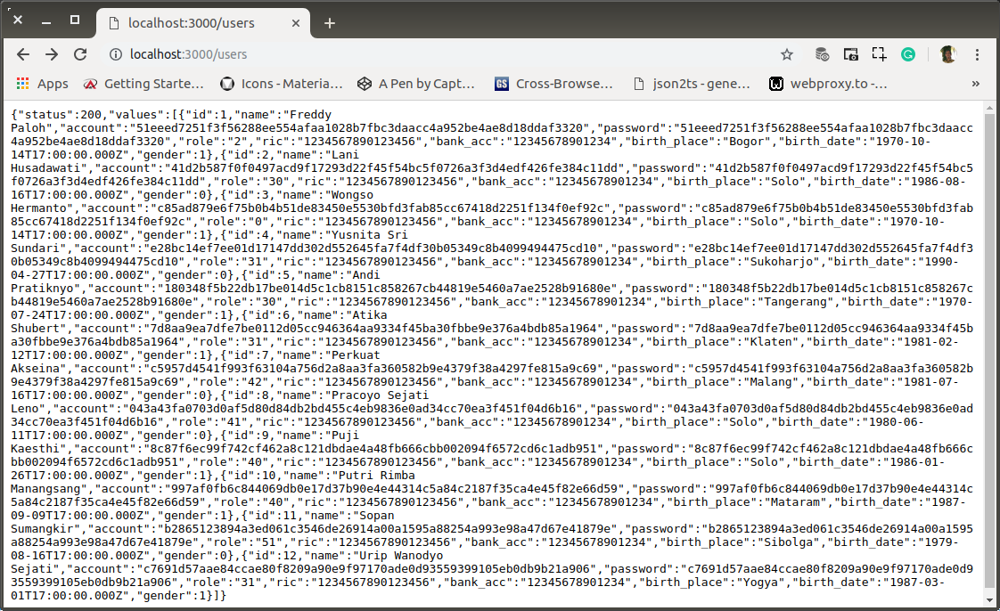

# ab-01-learn-read.md

**`16:52`**

Dimulai dari instalasi express, mysql driver dan body-parser sampai dengan pembuatan aplikasi pertama. Aplikasi yang sudah mampu meresponse permintaan `users` data.

## Preparation

0. Install `express`, `mysql` dan `body-parser`

    ```bash
    $ sudo npm install --save express mysql body-parser
    [sudo] password for wandyatmono: 
    npm WARN restful@0.0.0 No repository field.

    + mysql@2.17.1
    + express@4.17.1
    + body-parser@1.19.0
    updated 3 packages and audited 171 packages in 18.531s
    found 0 vulnerabilities
    ```

1. Membuat direktori proyek baru untuk RESTful API Server

    ```bash
    $ # /restful
    $ mkdir -p projects/ab-learn
    ```

2. Database Target dan Sebuah Tabel

    Dengan bantuan MySQL-Workbench, dibuat SCHEMA baru bernama `bpr`. Ke dalamnya kemudian dibuat table baru dengan nama `users` sekaligus dengan beberapa dummy-rows.

    Berikut petikan dari SQL-dumps yang saya simpan di `sqldumps/`

    ```bash
    $ # restful/
    $ mkdir sqldumps
    ```

    `bpr.users`

    ```sql
    DROP TABLE IF EXISTS `users`;
    CREATE TABLE `users` (
        `id` bigint(20) NOT NULL AUTO_INCREMENT,
        `name` varchar(64) COLLATE utf8_unicode_ci DEFAULT NULL,
        `account` varchar(256) CHARACTER SET utf8 DEFAULT NULL,
        `password` varchar(256) CHARACTER SET utf8 DEFAULT NULL,
        `role` varchar(2) CHARACTER SET utf8 DEFAULT NULL,
        `ric` varchar(16) CHARACTER SET utf8 DEFAULT NULL,
        `bank_acc` varchar(45) COLLATE utf8_unicode_ci DEFAULT NULL,
        `birth_place` varchar(45) COLLATE utf8_unicode_ci DEFAULT NULL,
        `birth_date` date DEFAULT NULL,
        `gender` tinyint(1) DEFAULT NULL,
        PRIMARY KEY (`id`)
    ) ENGINE=InnoDB AUTO_INCREMENT=13 DEFAULT CHARSET=utf8 COLLATE=utf8_unicode_ci;
    LOCK TABLES `users` WRITE;
    INSERT INTO `users` VALUES 
        (
            1,'Freddy Paloh','51eeed7251f3f56288ee554afaa1028b7fbc3daacc4a952be4ae8d18ddaf3320','51eeed7251f3f56288ee554afaa1028b7fbc3daacc4a952be4ae8d18ddaf3320','2','1234567890123456','12345678901234','Bogor','1970-10-15',1
        ),
        (
            2,'Lani Husadawati','41d2b587f0f0497acd9f17293d22f45f54bc5f0726a3f3d4edf426fe384c11dd','41d2b587f0f0497acd9f17293d22f45f54bc5f0726a3f3d4edf426fe384c11dd','30','1234567890123456','12345678901234','Solo','1986-08-17',0
        ),
        (
            3,'Wongso Hermanto','c85ad879e6f75b0b4b51de83450e5530bfd3fab85cc67418d2251f134f0ef92c','c85ad879e6f75b0b4b51de83450e5530bfd3fab85cc67418d2251f134f0ef92c','0','1234567890123456','12345678901234','Solo','1970-10-15',1
        ),
        (
            4,'Yusnita Sri Sundari','e28bc14ef7ee01d17147dd302d552645fa7f4df30b05349c8b4099494475cd10','e28bc14ef7ee01d17147dd302d552645fa7f4df30b05349c8b4099494475cd10','31','1234567890123456','12345678901234','Sukoharjo','1990-04-28',0
        ),
        (
            5,'Andi Pratiknyo','180348f5b22db17be014d5c1cb8151c858267cb44819e5460a7ae2528b91680e','180348f5b22db17be014d5c1cb8151c858267cb44819e5460a7ae2528b91680e','30','1234567890123456','12345678901234','Tangerang','1970-07-25',1
        ),
        (
            6,'Atika Shubert','7d8aa9ea7dfe7be0112d05cc946364aa9334f45ba30fbbe9e376a4bdb85a1964','7d8aa9ea7dfe7be0112d05cc946364aa9334f45ba30fbbe9e376a4bdb85a1964','31','1234567890123456','12345678901234','Klaten','1981-02-13',1
        ),
        (
            7,'Perkuat Akseina','c5957d4541f993f63104a756d2a8aa3fa360582b9e4379f38a4297fe815a9c69','c5957d4541f993f63104a756d2a8aa3fa360582b9e4379f38a4297fe815a9c69','42','1234567890123456','12345678901234','Malang','1981-07-17',0
        ),
        (
            8,'Pracoyo Sejati Leno','043a43fa0703d0af5d80d84db2bd455c4eb9836e0ad34cc70ea3f451f04d6b16','043a43fa0703d0af5d80d84db2bd455c4eb9836e0ad34cc70ea3f451f04d6b16','41','1234567890123456','12345678901234','Solo','1980-06-12',0
        ),
        (
            9,'Puji Kaesthi','8c87f6ec99f742cf462a8c121dbdae4a48fb666cbb002094f6572cd6c1adb951','8c87f6ec99f742cf462a8c121dbdae4a48fb666cbb002094f6572cd6c1adb951','40','1234567890123456','12345678901234','Solo','1986-01-27',1
        ),
        (
            10,'Putri Rimba Manangsang','997af0fb6c844069db0e17d37b90e4e44314c5a84c2187f35ca4e45f82e66d59','997af0fb6c844069db0e17d37b90e4e44314c5a84c2187f35ca4e45f82e66d59','40','1234567890123456','12345678901234','Mataram','1987-09-10',1
        ),
        (
            11,'Sopan Sumangkir','b2865123894a3ed061c3546de26914a00a1595a88254a993e98a47d67e41879e','b2865123894a3ed061c3546de26914a00a1595a88254a993e98a47d67e41879e','51','1234567890123456','12345678901234','Sibolga','1979-08-17',0
        ),
        (
            12,'Urip Wanodyo Sejati','c7691d57aae84ccae80f8209a90e9f97170ade0d93559399105eb0db9b21a906','c7691d57aae84ccae80f8209a90e9f97170ade0d93559399105eb0db9b21a906','31','1234567890123456','12345678901234','Yogya','1987-03-02',1
        );
    UNLOCK TABLES;
    ```

## First RESTful API Server

0. `index.js`


    ```bash
    $ # restful/
    $ cd projects/ab-learn
    $ touch index.js
    ```

    ```javascript
    var express = require('express'),
        app = express(),
        port = process.env.PORT || 3000,
        bodyParser = require('body-parser');

    app.use(bodyParser.urlencoded({ extended: true }));
    app.use(bodyParser.json());

    var routes = require('./routes');

    routes(app);

    app.listen(port);
    console.log('Learn RESTful API with Node JS, server started on: ' + port);
    ```

1. File koneksi antara database dan aplikasi.

    ```bash
    $ touch connection.js
    ```

    ```javascript
    var mysql = require('mysql');

    var db = mysql.createConnection({
        host     : 'localhost',
        user     : 'root',
        password : 'emd230661',
        database : 'bpr'

    });

    db.connect(function (err){
        if(err) throw err;
    });

    module.exports = db;
    ```

2. The controller

    ```bash
    $ touch controller.js
    ```

    ```javascript
    'use strict';

    var response = require('./response');
    var db = require('./connection');

    exports.users = function(req, res) {
        db.query('SELECT * FROM users', function (error, rows, fields){
            if(error){
                console.log(error)
            } else{
                response.ok(rows, res)
            }
        });
    };

    exports.index = function(req, res) {
        response.ok("Hello from the Node JS RESTful side!", res)
    };
    ```

3. Standarisasi response dengan `response.js`

    Fungsinya untuk mengetahui parameter apa yang di-return dan valuenya seperti apa aja. Agar meningkatkan efektifitas komunikasi anggota team.

    Untuk saat ini header tidak disertakan. Hanya `status`, `message` dan `Data`

    Contoh response yang diharapkan:

    ```json
    {
        "status": 1,
        "message": "Success",
        "Data": [
            {
                "id": "ENG",
                "name": "Enggar Hermani",
                "account": "43711ec4cd0434a2364b4572b687e3cef3cae88dd51db7564bcd1b5092f02d57",
                "password": "43711ec4cd0434a2364b4572b687e3cef3cae88dd51db7564bcd1b5092f02d57",
                "role": "2",
                "ric": "1234567890123456",
                "bank_acc": "12345678901234",
                "birth_place": "Bogor",
                "birth_date": "1970-10-15",
                "gender": 1,
                "photo": "enggar_hermani.jpg",
            }
        ]
    }
    ```

    ```bash
    $ touch response.js
    ```

    ```javascript
    'use strict';

    exports.ok = function(values, res) {
        var data = {
            'status': 200,
            'values': values
        };
        res.json(data);
        res.end();
    };
    ```

5. Endpoints

    ```bash
    $ touch routes.js
    ```

    ```javascript
    'use strict';

    module.exports = function(app) {
        var path = require('./controller');

        app.route('/')
            .get(path.index);

        app.route('/users')
            .get(path.users);
    };
    ```

9. Test, run `index.js` dengan `nodemon`

    ```bash
    $ nodemon index.js
    ```

    <p align="center">
        
        <br />Figure: ab-00-a-system-console.png
    </p>

10. Routes to `root` ('/')

    <p align="center">
        
        <br />Figure: ab-00-b-routes-to-root.png
    </p>

11. Routes to `users`

    <p align="center">
        
        <br />Figure: ab-00-c-routes-to-users.png
    </p>

**`17:41`**