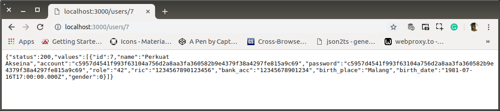

# ab-02-learn-read-params.md

`Minggu, 14 Juli 2019`

**`18:03`**

## Read with Parameter

0. Menambah method di controller, read dengan parameter

    `controller.js`

    ```javascript
    'use strict';

    var response = require('./response');
    var db = require('./connection');

    exports.findUser = function(req, res) {
        
        var user_id = req.params.user_id;

        db.query(
            'SELECT * FROM users where id = ?',
            [ user_id ], 
            function (error, rows, fields){
                if(error){
                    console.log(error)
                } else{
                    response.ok(rows, res)
                }
            }
        );
    };

    exports.users = function(req, res) { /* ... */ };

    exports.index = function(req, res) { /* ... */ };
    ```

1. Routes

    `routes.js`

    ```javascript
    'use strict';

    module.exports = function(app) {
        var path = require('./controller');

        app.route('/')
            .get(path.index);

        app.route('/user')
            .get(path.users);

        app.route('/users/:user_id')
            .get(path.findUser);
    };
    ```

2. Test

    <p align="center">
        
        <br />Figure: ab-02-a-read-with-param.png
    </p>

3. Selesai

**`18:14`**