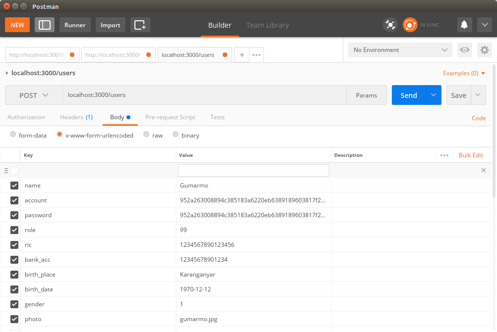
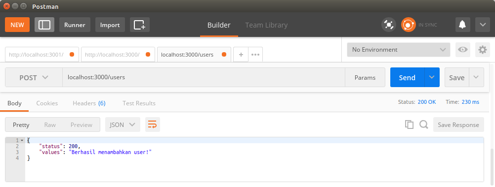
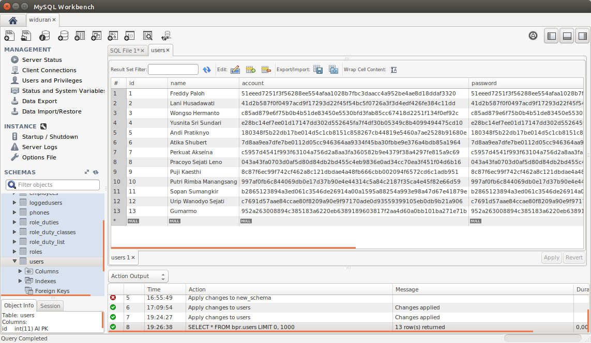
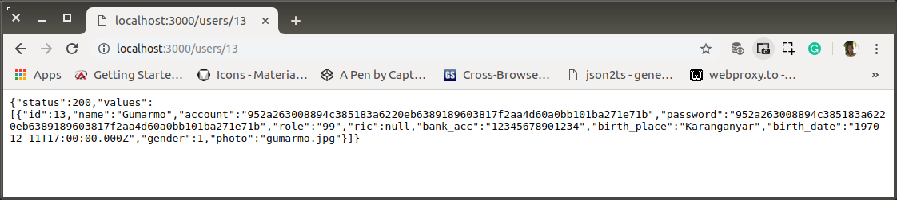

# ab-03-learn-create.md

`Minggu, 14 Juli 2019`

**`18:19`**

## Create

0. Menambah method di controller, `createUser`.

    `controller.js`

    ```javascript
    'use strict';

    var response = require('./response');
    var db = require('./connection');

    exports.createUser = function (req, res) {

        var name = req.body.name;
        var account = req.body.account;
        var password = req.body.password;
        var role = req.body.role;
        var ric = req.body.cc;
        var bank_acc = req.body.bank_acc;
        var birth_place = req.body.birth_place;
        var birth_date = req.body.birth_date;
        var gender = req.body.gender;
        var photo = req.body.photo;

        db.query(
            'INSERT INTO users (name, account, password, role, ric, bank_acc, birth_place, birth_date, gender, photo) values (?,?,?,?,?,?,?,?,?,?)',
            [name, account, password, role, ric, bank_acc, birth_place, birth_date, gender, photo],
            function (error, rows, fields) {
                if (error) {
                    console.log(error)
                } else {
                    response.ok("Berhasil menambahkan user!", res)
                }
            }
        );
    };

    exports.findUser = function(req, res) { /* ... */ };

    exports.users = function(req, res) { /* ... */ };

    exports.index = function(req, res) { /* ... */ };
    ```

1. Sehingga `users` routes harus bertambah dengan `post`

    `routes.js`

    ```javascript
    'use strict';

    module.exports = function(app) {
        var path = require('./controller');

        app.route('/')
            .get(path.index);

        app.route('/users')
            .get(path.users);

        app.route('/users/:user_id')
            .get(path.findUser);

        app.route('/users')
            .post(path.createUser);
    };
    ```

2. Pengujian, update data with POSTMAN - a chrome extension

    > Waktu request, data pada body harus bertipe `x-www-form-urlencoded` atau json. Bisa dipilih di `body` tab di `postman`.

    Data yang akan dimasukkan:

    name            : Gumarmo
    account         : 952a263008894c385183a6220eb6389189603817f2aa4d60a0bb101ba271e71b
    password        : 952a263008894c385183a6220eb6389189603817f2aa4d60a0bb101ba271e71b
    role            : 99
    ric             : `1234567890123456`
    bank_acc        : `12345678901234`
    birth_place     : Karanganyar
    birth_date      : 1970-12-12
    gender          : 1
    photo           : gumarmo.jpg

    `id` tidak diberikan karena `autoincrement`

    Posted data:

    <p align="center">
        
        <br />Figure: ab-03-a-postman.png
    </p>

    Result:

    <p align="center">
        
        <br />Figure: ab-03-b-created.png
    </p>

    Check result with MySQL Workbench:

    <p align="center">
        
        <br />Figure: ab-03-c-created.png
    </p>

    Check with browser:

    <p align="center">
        
        <br />Figure: ab-03-d-created.png
    </p>

3. Selesai

    Saya menghabiskan waktu yang cukup lama untuk men-download POSTMAN, tutorial singkatnya (video), mencoba dan akhirnya menerapkan. Semua dalam kondisi akses internet kura-kura biasa (tidak ninja).

    Saya mulai PeDe dengan upaya belajar ini. Harapannya, seluruh operasi CRUD dan hal 'aneh' lainnya dapat saya uji di `RESTful API Server` ini. Setelah 'pengetahuan' menjadi cukup matang, saya baru akan bergerak ke proyek aplikasi client (`common`) dan akhirnya kembali ke (`frontend`).

    Dengan POSTMAN, semua permasalahan pengujian penggunaan get, post, put, patch, delete, copy, head, dst. dapat dilakukan. Tidak perlu membuat aplikasi pengujian tersendiri.

    Sumber: https://medium.com/skyshidigital/documentation-testing-api-dengan-postman-part-1-5d33e430dca7

**`19:39`**
