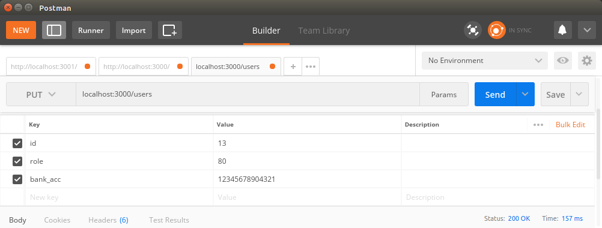
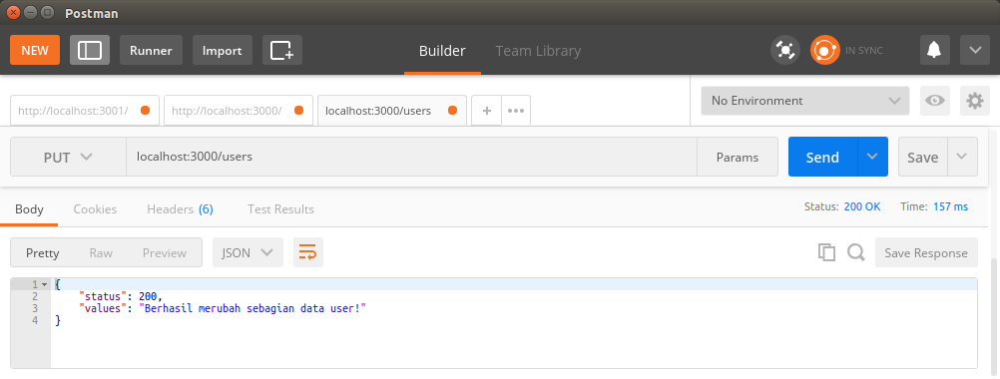
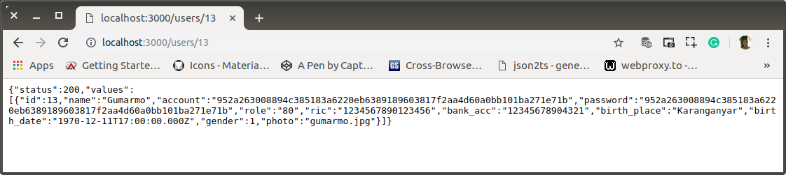

# ab-04-learn-update.md

`Minggu, 14 Juli 2019`

**`20:56`**

## Update

0. Menambah method di controller, `updateUser`

    `controller.js`

    ```javascript
    'use strict';

    var response = require('./response');
    var db = require('./connection');

    exports.updateUser = function(req, res) {
        
        var id = req.body.id;
        var role = req.body.role;
        var bank_acc = req.body.bank_acc;

        db.query(
            'UPDATE users SET role = ?, bank_acc = ? WHERE id = ?',
            [ role, bank_acc, id ],
            function (error, rows, fields){
                if(error){
                    console.log(error)
                } else{
                    response.ok("Berhasil merubah sebagian data user!", res)
                }
            }
        );
    };

    exports.createUser = function(req, res) { /* ... */ };

    exports.findUser = function(req, res) { /* ... */ };

    exports.users = function(req, res) { /* ... */ };

    exports.index = function(req, res) { /* ... */ };
    ```

1. Sehingga `users` routes harus bertambah dengan `put`

    `routes.js`

    ```javascript
    'use strict';

    module.exports = function(app) {
        var path = require('./controller');

        app.route('/')
            .get(path.index);

        app.route('/users')
            .get(path.users);

        app.route('/users/:user_id')
            .get(path.findUser);

        app.route('/users')
            .post(path.createUsers);

        app.route('/users')
            .put(path.updateUser);
    };
    ```

2. Test

    Postman request:

    <p align="center">
        
        <br />Figure: ab-04-a-postman-request.png
    </p>

    Postman Report:

    <p align="center">
        
        <br />Figure: ab-04-b-postman-report.png
    </p>

    Check with Browser:

    <p align="center">
        
        <br />Figure: ab-04-c-browser-check.png
    </p>

3. Selesai

**`21:24`**
