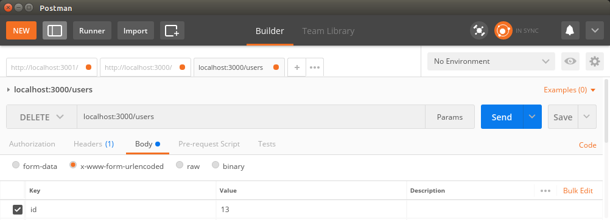
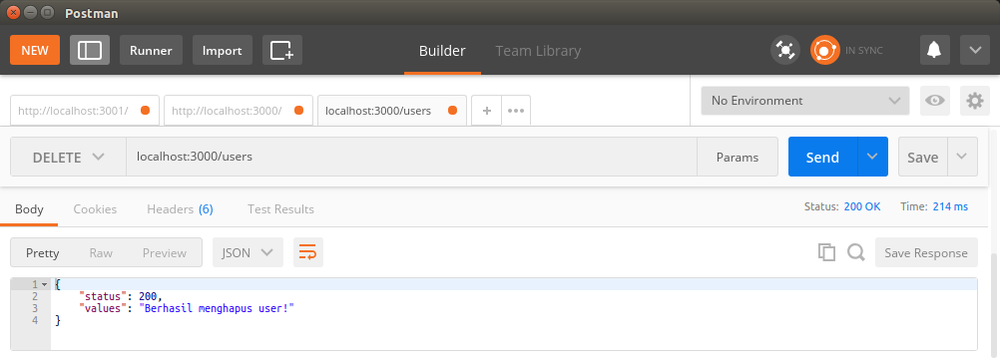
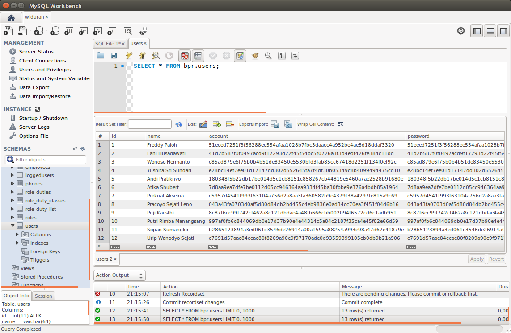

# ab-05-learn-delete.md

`Minggu, 14 Juli 2019`

**`21:29`**

## Delete

0. Menambah method di controller, `deleteUser`

    `controller.js`

    ```javascript
    'use strict';

    var response = require('./response');
    var db = require('./connection');

    exports.deleteUser = function(req, res) {
        
        var id = req.body.id;

        db.query(
            'DELETE FROM users WHERE id = ?',
            [ id ], 
            function (error, rows, fields){
                if(error){
                    console.log(error)
                } else{
                    response.ok("Berhasil menghapus user!", res)
                }
            }
        );
    };

    exports.updateUser = function(req, res) { /* ... */ };

    exports.createUser = function(req, res) { /* ... */ };

    exports.findUser = function(req, res) { /* ... */ };

    exports.users = function(req, res) { /* ... */ };

    exports.index = function(req, res) { /* ... */ };
    ```

1. Sehingga `users` routes harus bertambah dengan `delete`

    `routes.js`

    ```javascript
    'use strict';

    module.exports = function(app) {
        var path = require('./controller');

        app.route('/')
            .get(path.index);

        app.route('/users')
            .get(path.users);

        app.route('/users/:user_id')
            .get(path.findUser);

        app.route('/users')
            .post(path.createUsers);

        app.route('/users')
            .put(path.updateUser);
         
        app.route('/users')
            .delete(path.deleteUser);
    };
    ```

2. Request

    Postman request:

    <p align="center">
        
        <br />Figure: ab-05-a-postman-request.png
    </p>

    Postman Report:

    <p align="center">
        
        <br />Figure: ab-05-b-postman-report.png
    </p>

    MySQL Workbench Check:

    <p align="center">
        
        <br />Figure: ab-05-c-workbench-check.png
    </p>

4. Selesai

    Sholat.
    Siap-siap ke RS. Hermina. Cari rujukan ulang tingkat A untuk ke RSUD. Muwardi karena sudah lebih dari 90 hari kerja. Sasaran: dr. Tuko.

**`21:37`**
