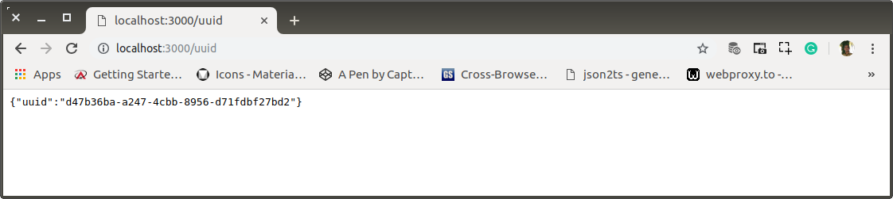

# ab-07-learn-uuid.md

`Minggu, 14 Juli 2019`

**`22:24`**

Agar setiap titik data penghubung memiliki identifikasi yang unique dan secure, berikut akan saya install sebuah package dari https://www.npmjs.com/package/uuid-random.

## Instalasi dan Penggunaan

0. Instalasi

    Catatan:
    
    Sebelum saat ini, `node_module` menjadi milik `root` sehingga setiap kali ada instalasi baru harus menggunakan `sudo` command. Oleh karena itu saya lakukan pengalihan kepemilikan agar menjadi milik user.
    
    ```bash
    $ sudo chown wandyatmono:wandyatmono node_modules/
    ```

    ```bash
    # restful/
    $ npm install uuid-random --save
    npm WARN restful@0.0.0 No repository field.

    + uuid-random@1.0.9
    added 1 package from 1 contributor and audited 173 packages in 7.238s
    found 0 vulnerabilities
    ```

1. Routes

    `routes.js`

    ```javascript
    'use strict';

    module.exports = function(app) {
        var path = require('./controller');

        app.route('/')
            .get(path.index);

        app.route('/users')
            .get(path.users);

        app.route('/users/:user_id')
            .get(path.findUser);

        app.route('/users')
            .post(path.createUser);
        
        app.route('/users')
            .put(path.updateUser);

        app.route('/users')
            .delete(path.deleteUser);
            
        app.route('/sha256/:data')
            .get(path.sha256);

        app.route('/uuid')
            .get(path.uuid);
    };
    ```

2. Controllers

    `controller.js`

    ```javascript
    'use strict';

    var response = require('./response');
    var db = require('./connection');
    var sha256 = require('js-sha256').sha256;
    var uuid = require('uuid-random');

    exports.uuid = function (req, res) {
        var result = {};
        result.uuid = uuid();
        res.send(result);
    };

    exports.sha256 = function (req, res) {
        var result = {};
        result.data = sha256(req.params.data);
        res.send(result);
    }

    exports.deleteUser = function (req, res) {

        var id = req.body.id;

        db.query(
            'DELETE FROM users WHERE id = ?',
            [id],
            function (error, rows, fields) {
                if (error) {
                    console.log(error)
                } else {
                    response.ok("Berhasil menghapus user!", res)
                }
            }
        );
    };

    exports.updateUser = function (req, res) {

        var id = req.body.id;
        var role = req.body.role;
        var bank_acc = req.body.bank_acc;

        db.query(
            'UPDATE users SET role = ?, bank_acc = ? WHERE id = ?',
            [role, bank_acc, id],
            function (error, rows, fields) {
                if (error) {
                    console.log(error)
                } else {
                    response.ok("Berhasil merubah sebagian data user!", res)
                }
            }
        );
    };

    exports.createUser = function (req, res) {

        var name = req.body.name;
        var account = req.body.account;
        var password = req.body.password;
        var role = req.body.role;
        var ric = req.body.cc;
        var bank_acc = req.body.bank_acc;
        var birth_place = req.body.birth_place;
        var birth_date = req.body.birth_date;
        var gender = req.body.gender;
        var photo = req.body.photo;

        db.query(
            'INSERT INTO users (name, account, password, role, ric, bank_acc, birth_place, birth_date, gender, photo) values (?,?,?,?,?,?,?,?,?,?)',
            [name, account, password, role, ric, bank_acc, birth_place, birth_date, gender, photo],
            function (error, rows, fields) {
                if (error) {
                    console.log(error)
                } else {
                    response.ok("Berhasil menambahkan user!", res)
                }
            }
        );
    };

    exports.findUser = function (req, res) {

        var user_id = req.params.user_id;

        db.query(
            'SELECT * FROM users where id = ?',
            [user_id],
            function (error, rows, fields) {
                if (error) {
                    console.log(error)
                } else {
                    response.ok(rows, res)
                }
            }
        );
    };

    exports.users = function (req, res) {
        db.query('SELECT * FROM users', function (error, rows, fields) {
            if (error) {
                console.log(error)
            } else {
                response.ok(rows, res)
            }
        });
    };

    exports.index = function (req, res) {
        response.ok("Hello from the Node JS RESTful side!", res)
    };
    ```

3. Test

    <p align="center">
        
        <br />Figure: ab-07-a-uuid.png
    </p>

**`22:40`**