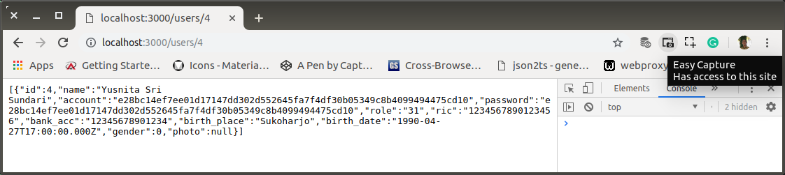
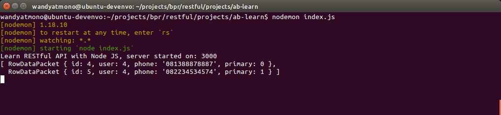
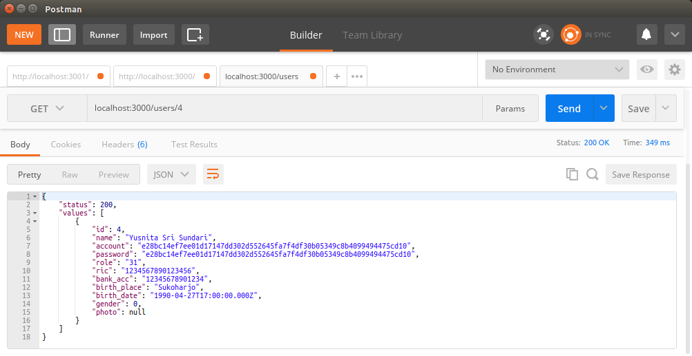

# ab-09-learn-async.md

`Senin, 15 Juli 2019`

**`07:19`**

## Atasi Callback Hell dengan Promise dan Await

Apakah Callback Hell?

**Callback Hell adalah struktur code dasar javascript yang pada umumnya menggunakan callback untuk mendapatkan hasil, semakin banyak fungsi callback yang kita gunakan maka struktur code javascript akan semakin buruk dan bertingkat layaknya piramida.**

Contoh callback pada salah satu method di `RESTful` API controller

`controllers.js` snippet

```javascript
exports.users = function(req, res) {
    db.query(
        'SELECT * FROM person', 
        function (error, rows, fields) {
            if(error) {
                console.log(error)
            } else{
                response.ok(rows, res)
            }
        }
    );
};
```

Pada fungsi `users`, pemanggilan query method milik `db` disertai 2 buah argument. Yaitu query sql string dan `function (error, rows, fields)`. 

Argumen kedua ini yang berfungsi sebagai **callback**.

Sedangkan `db.query` sendiri memiliki 3 buah kembalian.

1. Error, apabila ada SQL Exception
2. rows, data dari database apabila tidak ada exception
3. fields, fields dari masing-masing table.

Dan ketiga kembalian tersebut ditangkap oleh fungsi callback.

Sebelum semua kembalian diterima, seharusnya semua threads yang membutuhkan kembalian tersebut di-block terlebih dahulu.

Dengan pengetahuan yang telah ditulis di `ab-08-callback-hell.md` yang aslinya berasal dari tutorial di situs [callbackhell.com](http://callbackhell.com/) berikut akan kita implementasikan `promise` dan `await` dari javascript.

Kasus:

Setiap user yang terekam di `users` seharusnya memiliki nomor telepon. Tetapi karena setiap user dapat memiliki lebih dari 1 nomor, maka agar 'normal', nomor-nomor para user harus direkam ke dalam `phones`

```sql
CREATE DATABASE  IF NOT EXISTS `bpr` /*!40100 DEFAULT CHARACTER SET latin1 */;
USE `bpr`;
DROP TABLE IF EXISTS `phones`;
CREATE TABLE `phones` (
  `id` int(11) NOT NULL AUTO_INCREMENT,
  `user` bigint(20) NOT NULL,
  `phone` varchar(20) CHARACTER SET utf8 NOT NULL DEFAULT '0',
  `primary` tinyint(4) NOT NULL DEFAULT '0',
  PRIMARY KEY (`id`)
) ENGINE=InnoDB AUTO_INCREMENT=8 DEFAULT CHARSET=utf8 COLLATE=utf8_unicode_ci;
LOCK TABLES `phones` WRITE;
INSERT INTO `phones` VALUES 
    (1,1,'081345622345',0),
    (2,2,'081587565556',0),
    (3,3,'081387945676',0),
    (4,4,'081388878887',0),
    (5,4,'082234534574',1),
    (6,5,'081598978778',0),
    (7,6,'081554999976',0),
    (8,7,'081387458744',0),
    (9,8,'081227887877',0),
    (10,9,'081128769895',0),
    (11,10,'081197834834',0),
    (12,11,'081234534544',0),
    (13,12,'081199978786',0);
UNLOCK TABLES;
```

Implementasi pada `findUser()` di `controller.js` yang semula,

`controller.js` snippet

```javascript
exports.findUsers = function(req, res) {
    
    var user_id = req.params.user_id;

    db.query('SELECT * FROM users where id = ?',
    [ user_id ], 
    function (error, rows, fields){
        if(error){
            console.log(error)
        } else{
            response.ok(rows, res)
        }
    });
};
```

0. Pertama dibuat dulu satu method dengan nama `findPhone()` yang nantinya akan dibutuhkan oleh `findUser()`

    `controller.js` snippet

    ```javascript
    function findPhone(id) {
        return new Promise(resolve => {
            var query = 'SELECT * FROM phones where user = ?';
            db.query(
                query,
                [ id ], 
                function (error, rows, fields) {
                    if(error){
                        console.log(error)
                    } else{
                        resolve(rows);
                    }
                }
            );
        });
    }
    ```

1. Update `findUser()`

    `controller.js` snippet

    ```javascript
    exports.findUser = async function(req, res) {

        var user_id = req.params.user;

        let phones = await findPhone(user_id);
        console.log(phones);

        var query = 'SELECT * FROM users where id = ?';
        db.query(
            query,
            [ user_id ],
            function (error, rows, fields){
                if(error){
                    console.log(error)
                } else{
                    return response(rows, res)
                }
            }
        );
    };
    ```

    > Sql string di-assign ke dalam sebuah variable terlebih dahulu seperti halnya pada method `findPhone()`.
    > `controlers` berstruktur demikian tidak dijumpai di real-world.
    > Karena pengembangan di titik ini hanya untuk menunjukkan bagaimana mengatasi callback-hell. Seharusnya query ke database adalah JOIN operation agar response-nya dapat ditampilkan ke browser.

2. Request lewat browser

<p align="center">
	
    <br />Figure: ab-09-a-browser-request.png
</p>

3. Response di console saat ada request

<p align="center">
	
    <br />Figure: ab-09-b-console.png
</p>

4. Dengan POSTMAN

<p align="center">
	
    <br />Figure: ab-09-c-postman.png
</p>

5. Selesai

**`10:07`**