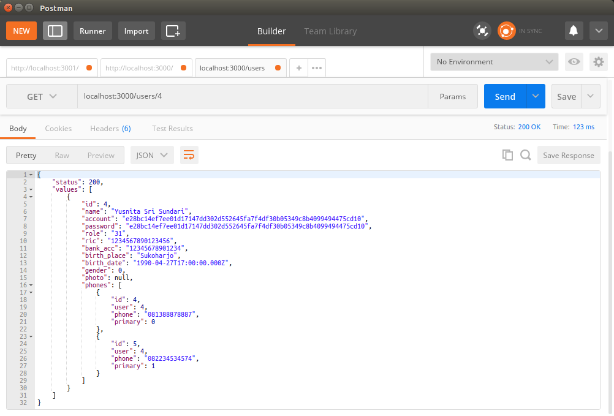

# ab-10-learn-compound.md

`Senin, 15 Juli 2019`

**`10:32`**

Saya ingin nge-blend alias membuat data compound. Nomor telepon dari user yang bersangkutan supaya dapat bergabung ke data induknya saat diberikan kepada client.

0. Memeriksa konten dari `rows` dan `phones` di controller, dengan echo ke console

    `controller.js`

    ```javascript
    function findPhone(id) {
        return new Promise(resolve => {
            var query = 'SELECT * FROM phones where user = ?';
            db.query(
                query,
                [id],
                function (error, rows, fields) {
                    if (error) {
                        console.log(error)
                    } else {
                        resolve(rows); //Kembalian berupa phone data
                    }
                }
            );
        });
    }

    exports.findUser = async function (req, res) {

        var user_id = req.params.user_id;

        let phones = await findPhone(user_id);
        console.log(phones);

        var query = 'SELECT * FROM users where id = ?';
        db.query(
            query,
            [user_id],
            function (error, rows, fields) {
                if (error) {
                    console.log(error)
                } else {
                    console.log(rows);
                    console.log(phones);
                    return response.ok(rows, res)
                }
            }
        );
    };
    ```

    <p align="center">
        
        <br />Figure: ab-10-a-rows-phones.png
    </p>

    Terlihat bahwa `rows` adalah sebuah RowDataPacket array walaupun hanya berisi sebuah user row saja. `phones` juga merupakan RowDataPacket array yang berisi dua buah phone rows yang sesuai dengan user row.

1. Menggabungkan data

    Setelah `phones` di `resolve()` oleh `findPhone()` dan setelah query ke MySQL engine telah menghasilkan `rows`, maka `phones` segera digabung sebelum `rows` dijadikan JSON dan diberi status oleh `response.ok()` serta di-return ke client yang melakukan request.

    Caranya dengan menambahkan property baru kepada `rows` (`row.phones`) dengan value `phones`.

    `controller.js`

    ```javascript
    function findPhone(id) {
        return new Promise(resolve => {
            var query = 'SELECT * FROM phones where user = ?';
            db.query(
                query,
                [id],
                function (error, rows, fields) {
                    if (error) {
                        console.log(error)
                    } else {
                        resolve(rows);
                    }
                }
            );
        });
    }

    exports.findUser = async function (req, res) {

        var user_id = req.params.user_id;

        let phones = await findPhone(user_id);

        var query = 'SELECT * FROM users where id = ?';
        db.query(
            query,
            [user_id],
            function (error, rows, fields) {
                if (error) {
                    console.log(error)
                } else {
                    rows[0].phones = phones;
                    return response.ok(rows, res)
                }
            }
        );
    };
    ```

    <p align="center">
        
        <br />Figure: ab-10-b-rows-phones.png
    </p>

    Sekarang data yang diterima oleh client sudah lengkap dengan semua nomor telepon dari user yang bersangkutan.

    Dengan POSTMAN,

    <p align="center">
        
        <br />Figure: ab-10-c-rows-phones.png
    </p>

2. Handling runtime-error

    Syntax-error tentu sudah diurus saat pengembangan, system-error juga sudah di-handle. Tetapi untuk runtime-error perlu dihandle secara khusus karena MySQL interface hanya menghasilkan nilai '`undefined`' saat data tidak diketemukan. Oleh karena itu perlu ditambahkan logic sebagai berikut:

    `controller.js`

    ```javascript
    function findPhone(id) {
        return new Promise(resolve => {
            var query = 'SELECT * FROM phones where user = ?';
            db.query(
                query,
                [id],
                function (error, rows, fields) {
                    if (error) {
                        console.log(error)
                    } else {
                        resolve(rows);
                    }
                }
            );
        });
    }

    exports.findUser = async function (req, res) {

        var user_id = req.params.user_id;

        let phones = await findPhone(user_id);

        var query = 'SELECT * FROM users where id = ?';
        db.query(
            query,
            [user_id],
            function (error, rows, fields) {
                if (rows[0] === undefined) {
                    rows[0] = "Not Found!";
                    return response.ops(rows, res);
                } else {
                    rows[0].phones = phones;
                    return response.ok(rows, res);
                }
            }
        );
    };
    ```

    Perlu ditambahkan method `ops()` di `response.js`

    `response.js`

    ```javascript
    'use strict';

    exports.ops = function (values, res) {
        var data = {
            'status': 999,
            'values': values
        };
        res.json(data);
        res.end();
    };

    exports.ok = function (values, res) {
        var data = {
            'status': 200,
            'values': values
        };
        res.json(data);
        res.end();
    };
    ```

    <p align="center">
        
        <br />Figure: ab-10-d-runtime-error.png
    </p>

Kemungkinan besar, di sisi server. saya akan menggunakan `express`. Dibanding dengan reactive programming library lain, issues-nya terendah. Saya [membaca di sini](https://www.npmtrends.com/axios-vs-express-vs-react-vs-rxjs).

**`11:00`**