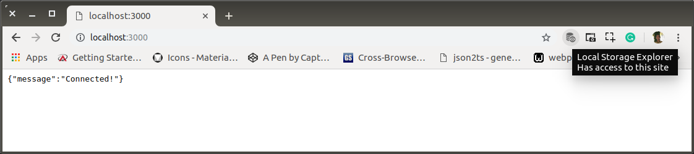
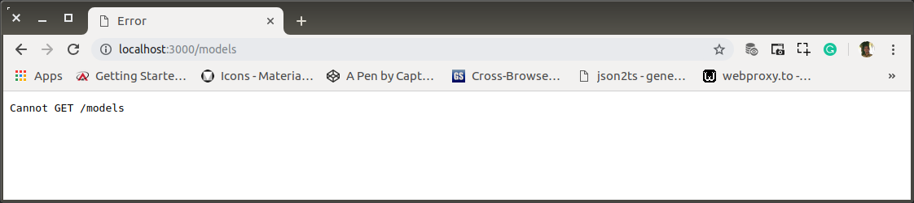
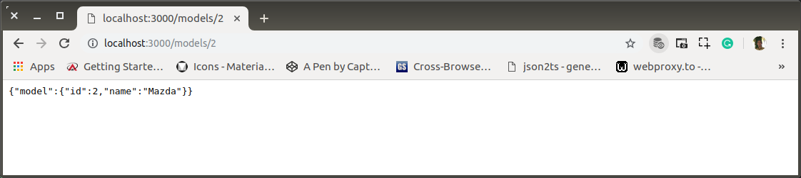
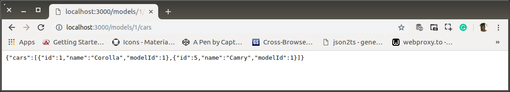
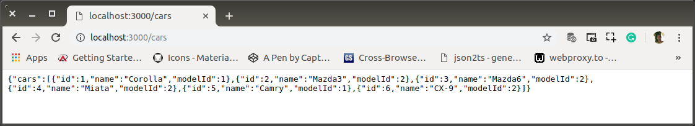
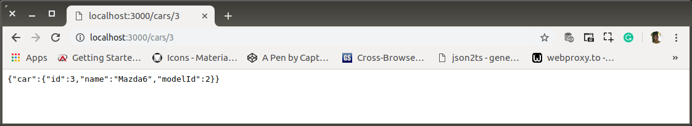
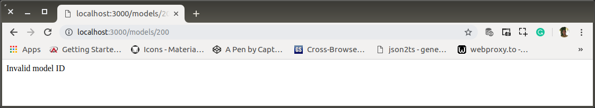

# Keeping Routing API Clean

`Senin, 15 Juli 2019`

**`12:43`**

Routing is hard.

That's a little too broad of a statement. What I really mean is "organizing routing in large applications and APIs so that it's easy to find and maintain in the future" is hard.

As code bases get more mature and complex, they grow in size. (You have unit tests, right?) One place where things get hairy is with the organization of the code that handles your routing.

Routing is extremely important. It defines the URL structure that someone uses to interact with your web application. If it's not organized well, it can be hard to find the logic for "that one route that never seems to work and all our customers are complaining about. What the hell was the original developer thinking anyway!"

**Takes breath**

There's light at the end of the tunnel, folks. Express apps utilize routers that are essentially containers for a set of middleware. We can put this middleware holder only on a certain route, which allows us to keep our logic in separate files and bring them together on our terms! We are going to build a very simple car API. We will be implementing the following routes in the application.

```bash
GET /models
GET /models/:modelId
GET /models/:modelId/cars
GET /cars
GET /cars/:carId
```

## Preparation

0. Create New Project

    ```bash
    $ # restful/
    $ mkdir -p projects/ac-clean
    ```

1. Now let's create a file that will hold our JSON data for this API. Put the following in a file at the root called `data.json`.

    ```bash
    $ cd projects/ac-clean
    $ touch data.json
    ```

    `data.json`

    ```json
    {
        "models": [
            {
                "id": 1,
                "name": "Toyota"
            },
            {
                "id": 2,
                "name": "Mazda"
            }
        ],
        "cars": [
            {
                "id": 1,
                "name": "Corolla",
                "modelId": 1
            },
            {
                "id": 2,
                "name": "Mazda3",
                "modelId": 2
            },
            {
                "id": 3,
                "name": "Mazda6",
                "modelId": 2
            },
            {
                "id": 4,
                "name": "Miata",
                "modelId": 2
            },
            {
                "id": 5,
                "name": "Camry",
                "modelId": 1
            },
            {
                "id": 6,
                "name": "CX-9",
                "modelId": 2
            }
        ]
    }
    ```

1. Create a file in the root of our project called `app.js` and put the following into it.

    `app.js`

    ```javascript
    // Bring in our dependencies
    const app = require('express')();
    const routes = require('./routes');

    //  Connect all our routes to our application
    app.use('/', routes);

    // Turn on that server!
    app.listen(3000, () => {
        console.log('App listening on port 3000');
    });
    ```

    Nothing crazy is happening here. We are bringing in Express and our routes. We are connecting our routes to our application using .use.

2. Lastly, we are turning the server on. Let's create those routes now. Create a file at `routes/index.js` and put the following in it.

    ```bash
    $ $ # restful/projects/ac-clean
    $ mkdir routes
    $ touch routes/index.js
    ```

    `routes/index.js`

    ```javascript
    const routes = require('express').Router();

    routes.get('/', (req, res) => {
        res.status(200).json({ message: 'Connected!' });
    });

    module.exports = routes;
    ```

    This is a pattern you will see throughout this tutorial. First, we are requiring **Express** and creating a new instance of `Router` on it. We are holding that in a variable called `routes`. Then we are creating a route at the root path of this `Router` that sends back a simple message. Then we export the `Router`.

    This `Router` is the "container" for the middleware on this route. Notice in `app.js` that we imported this module, which exports a Router, and attaches it at the root path of our API.

    That means the middleware and routes attached to this Router will be run as long as we are accessing a route that starts at the root path, which always happens! And since we added a route at the root of this router, that means it will be hit when someone visits our root path.

3. Start up the server with npm start and view localhost:3000 in your browser. You should see our message popup. We will follow a similar pattern for the rest of the API.

    <p align="center">
        
        <br />Figure: ac-00-a-startup.png
    </p>

**`14:54`**

**`15:28`**

## Routes

Let's create our model routes now. 

0. Create a file at `routes/models/index.js`. Put the code below in it.

    ```bash
    $ # restful/projects/ac-clean
    $ mkdir routes/models
    $ touch routes/models/index.js
    ```

    `routes/models/index.js`

    ```javascript
    const models = require('express').Router();
    const all = require('./all');

    models.get('/', all);

    module.exports = models;
    ```

    This should look almost dead on the previous one we created. This time we are bringing in a route from a file in the same directory called `all.js`.

1. Let's create that next. Put the following in a file at `routes/models/all.js`.

    ```bash
    $ # restful/projects/ac-clean
    $ touch routes/models/all.js
    ```

    `routes/models/all.js`

    ```javascript
    const data = require('../../data.json');

    module.exports = (req, res) => {
        const models = data.models;

        res.status(200).json({ models });
    };
    ```

    We are importing our data. Then grabbing all the models and returning them in the response. Our server should be restarting on its own.

2. So visit `localhost:3000/models` in the browser...yeah. We get an error. 

    Why doesn't it know about our new route? It's because we never connected the models `Router` to our routes `Router`.

    <p align="center">
        
        <br />Figure: ac-00-b-models-error.png
    </p>

3. Add the following into `routes/index.js`

    `routes/index.js` 

    ```javascript
    const routes = require('express').Router();
    const models = require('./models');

    routes.use('/models', models);

    routes.get('/', (req, res) => {
        res.status(200).json({ message: 'Connected!' });
    });

    module.exports = routes;
    ```

    This imports all our model routes and attaches them to the main router of our application. Now you should be able to see all our models in the browser. 
    
4. Test

    <p align="center">
        
        <br />Figure: ac-00-c-models.png
    </p>

5. Let's make the next route so we can get only one model. Put the following in `routes/models/single.js`.

    ```bash
    $ # restful/projects/ac-clean
    $ touch routes/models/single.js
    ```

    `routes/models/single.js`

    ```javascript
    const data = require('../../data.json');

    module.exports = (req, res) => {
        const modelId = req.params.modelId * 1;
        const model = data.models.find(m => m.id === modelId);

        res.status(200).json({ model });
    };
    ```

    We are finding the model and returning it. The line `req.params.modelId * 1` simply coerces our `modelId` from a string into an integer. We need it as an integer since that is how it's stored in our data file.

6. Add the following to `routes/models/index.js` to connect this route to our application.

    `routes/models/index.js` snippet

    ```javascript
    const models = require('express').Router();
    const all = require('./all');
    const single = require('./single');

    models.get('/:modelId', single);

    models.get('/', all);

    module.exports = models;
    ```

7. Now try going to localhost:3000/models/2 in your browser. You'll see information about Mazda. 

    <p align="center">
        
        <br />Figure: ac-00-d-find-model.png
    </p>

    Excellent!

**`17:16`**

**`18:40`**
    
7. We need to add cars as a nested resource of models. We can do this by simply creating another `Router` and attaching it to our models `Router`. First, add the following to `routes/models/index.js`.

    `routes/models/index.js` snippet

    ```javascript
    const cars = require('./cars');

    models.use('/:modelId/cars', cars);
    ```

    Notice how we are putting this next router behind a route that starts with a model ID and ends with cars. That means anything on this next router will have to start with that plus anything this current router had to start with to be hit (/models/:modelId/cars). 
    
8. Next, create a file at `routes/models/cars/index.js` and put the following in it.

    ```bash
    $ # restful/projects/ac-clean
    $ mkdir routes/models/cars
    $ touch routes/models/cars/index.js
    ```

    `routes/models/cars/index.js`

    ```javascript
    const cars = require('express').Router({ mergeParams: true });
    const all = require('./all');

    cars.get('/', all);

    module.exports = cars;
    ```

    This should look very familiar by now! The only new thing here is the `mergeParams: true` option passed when creating the `Router`. This tells the `Router` to merge parameters that are created on this set of routes with the ones from its parents. Without this, we wouldn't have access to the `modelId` from any of the routes connected to this `Router`.

9. Now we just need to create the logic for our all route. Create a file at `/routes/models/cars/all.js`, and put the following in it:

    ```bash
    $ # restful/projects/ac-clean
    $ touch routes/models/cars/all.js
    ```

    `/routes/models/cars/all.js`

    ```javascript
    const data = require('../../../data.json');

    module.exports = (req, res) => {
        const modelId = req.params.modelId * 1;
        const cars = data.cars.filter(c => c.modelId === modelId);

        res.status(200).json({ cars });
    };
    ```

    Pretty simple. Just getting all the cars that have a `modelId` matching the one in the URL. Try it out in the browser. Check out `localhost:3000/models/1/cars`. You should see all cars in our "database" made by 'Toyota'.

10. Test

    <p align="center">
        
        <br />Figure: ac-00-e-all-cars-with-filter.png
    </p>

11. Now, we need to make routes for cars, but they need to be at the top level, not behind models. Because of the way we have organized things, this is a cinch. Add the following to `routes/index.js`.

    `routes/index.js` snippet

    ```javascript
    const cars = require('./cars');

    routes.use('/cars', cars);
    ```

    Here were simply attaching a new `Router` to our main `Router`. 
    
12. Let's create it now. Create a file at `/routes/cars/index.js` and put the following in it.

    ```bash
    $ # restful/projects/ac-clean
    $ mkdir routes/cars
    $ touch routes/cars/index.js
    ```

    `/routes/cars/index.js`

    ```javascript
    const cars = require('express').Router();
    const all = require('./all');
    const single = require('./single');

    cars.get('/', all);
    cars.get('/:carId', single);

    module.exports = cars;
    ```

    This should look extremely familiar, so I won't bore you with another explanation. 
    
13. Put the following in a file at `routes/cars/all.js`.

    ```bash
    $ # restful/projects/ac-clean
    $ touch routes/cars/all.js
    ```

    `routes/cars/all.js`

    ```javascript
    const data = require('../../data.json');

    module.exports = (req, res) => {
        const cars = data.cars;

        res.status(200).json({ cars });
    };
    ```

14. Lastly, insert the following into a file at `routes/cars/single.js`.

    ```bash
    $ # restful/projects/ac-clean
    $ touch routes/cars/single.js
    ```

    `routes/cars/single.js`

    ```javascript
    const data = require('../../data.json');

    module.exports = (req, res) => {
        const carId = req.params.carId * 1;
        const car = data.cars.find(c => c.id === carId);

        res.status(200).json({ car });
    };
    ```

15. Go to the browser and check out our new route. You should be able to see all the cars in our database at `localhost:3000/cars` and see data about the 'Mazda6' at `localhost:3000/cars/3`. Pretty sweet!

    <p align="center">
        
        <br />Figure: ac-00-f-all-cars.png
    </p>

    <p align="center">
        
        <br />Figure: ac-00-g-mazda6.png
    </p>

## Make a Middleware

Now we have a working API, but there is something bothering me. When we try to see data about a model that doesn't exist, like /models/200, we should get a 404 error, but we don't. We get an empty object. That's not cool with me. Let's fix this.

Instead of implementing this in every single route handler we have, let's create some middleware that will do it for us. We can add some middleware onto our routers that will only get called when those routes are hit. Let's add a param middleware to our models `Router` to make sure the model exists. If it doesn't, we want to return a 404.

0. Add the following to `routes/models/index.js`:

    `routes/models/index.js`

    ```javascript
    const data = require('../../data.json');

    models.param('modelId', (req, res, next, value) => {
        const model = data.models.find(m => m.id === (value * 1));

        if (model) {
            req['model'] = model;
            next();
        } else {
            res.status(404).send('Invalid model ID');
        }
    });
    ```

    We are importing our `data`. Then we add a `param` middleware to the `Router`. This middleware will be called whenever `modelId` is present in the URL. This is perfect since this is what we want to validate! We are finding the model, and if it doesn't exist, we return a `404`. If it does exist, we put it on the request for later usage, and then move on to the next piece of middleware.

1. Now try viewing a model that doesn't exist in the browser, say `localhost:3000/models/200`. 

    <p align="center">
        
        <br />Figure: ac-00-h-404.png
    </p>

    You can see we now get a `404` error. Yay! Also notice that if you try to access any routes nested behind this route, it will 404 also. Try going to localhost:3000/models/200/cars. You get a 404? Boom!

2. Now let's add it to our cars routes. Add the following to `routes/cars/index.js`.

    `routes/cars/index.js`

    ```javascript
    const data = require('../../data.json');

    cars.param('carId', (req, res, next, value) => {
        const car = data.cars.find(c => c.id === (value * 1));

        if (car) {
            req['car'] = car;
            next();
        } else {
            res.status(404).send('Invalid car ID');
        }
    });
    ```

**`22:10`**

`Selasa, 16 Juli 2019`

**`09:52`**

## Refactoring to the rescue!

Now we have some pretty sweet stuff going on here, but I'm still not satisfied. The code we just added to each of those index files looks waaaaaay too similar. Refactoring to the rescue!

0. Create a file at `utils/findObject.js` and put the following in it.

    ```bash
    $ # restful/projects/ac-clean
    $ mkdir routes/utils
    $ touch routes/utils/findObject.js
    ```

    `utils/findObject.js`

    ```javascript
    const data = require('../../data.json');

    module.exports = type => {
        return (req, res, next, value) => {
            const typePlural = `${type}s`;
            const obj = data[typePlural].find(t => t.id === (value * 1));

            if (obj) {
                req[type] = obj;
                next();
            } else {
                res.status(404).send(`Invalid ${type} ID`);
            }
        };
    };
    ```

    This should look very familiar. This code here is a function that, when called, returns our middleware function that we used in the previous two files. Our function takes a `type`. In our case, this `type` will be either "car" or "model." We use this type to make sure we search through the correct piece of data for our object and then to make sure we add the correct piece of data to the request. Now we can use this to clean up our files from before. 
    
1. Replace the code we just added to the following in each of the given files.

    `routes/models/index.js` snippet

    ```javascript
    const findObject = require('../utils/findObject');

    models.param('modelId', findObject('model'));
    ```

    `routes/cars/index.js`

    ```javascript
    const findObject = require('../utils/findObject');

    cars.param('carId', findObject('car'));
    ```

    So. Much. Cleaner! If you view things in the browser, you will see that things still work the same, yet the code is cleaner and more modularized. 
    
2. We can also clean up some of our route handlers since we have access to that object in the request by the time the handler is hit.

    `routes/models/single.js`

    ```javascript
    const data = require('../../data.json');

    module.exports = (req, res) => {
        const modelId = req.params.modelId * 1;
        const model = data.models.find(m => m.id === modelId);

        res.status(200).json({ model });
    };

    module.exports = (req, res) => {
        const model = req.model;

        res.status(200).json({ model });
    };
    ```

    If you try this in your browser, it still works! Beautiful!

## Selesai

Routing is super important once apps start getting bigger and more complex. Having a good base for your routes will help you out in the future. Using this technique will make sure that you never have to spend a ton of time looking for a route handler. Just make sure the file structure follows the URL structure, and you're good to go!

PENTING!

0. Perlu pendalaman lagi.
1. Memantapkan penyusunan JS functions.

**`10:45`**


