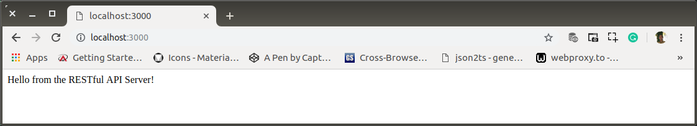
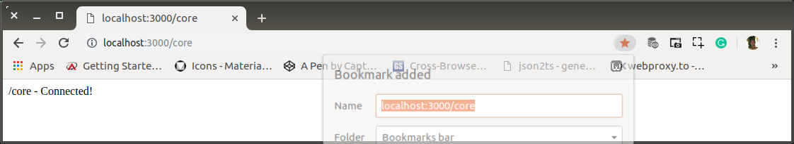
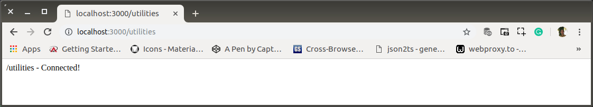

# ad-01-structure-refactoring.md

`Selasa, 16 Juli 2019`

**`11:15`**

## Preparation

Sebenarnya aplikasi sudah memiliki struktur yang cukup baik, tetapi hanya cocok untuk aplikasi yang tak terlalu kompleks urusannya. Oleh karena itu subversion ini akan dikembangkan untuk tujuan yang sama tetapi diimplementasikan dengan refactoring yang rapi.

Pengembangan akan benar-benar dimulai dari scratch. Langkah-langkah dibuat dengan seseksama mungkin agar dapat diperoleh pemahaman yang baik. Pemahaman yang tidak hanya berguna untuk pengembangan selanjutnya tetapi tentu saja berguna untuk menghasilkan subversion yang baik.

0. Membuat Aplikasi 

    ```bash
    $ # restful/projects/ad-structure
    $ # app-root
    $ touch index.js
    ```

    `/index.js`
    
    ```javascript
    var app = require('express')(),
        port = process.env.PORT || 3000,
        bodyParser = require('body-parser'),
        routes = require('./routes');

    app.use(bodyParser.urlencoded({ extended: true }));
    app.use(bodyParser.json());

    app.use(function(req, res, next) {
        res.header("Access-Control-Allow-Origin", "*");
        res.header("Access-Control-Allow-Headers", "Origin, X-Requested-With, Content-Type, Accept");
        next();
    });

    app.use('/', routes);

    app.listen(port, () => {
        console.log('');
        console.log('"BPR" Field Working Performance System');
        console.log('RESTful API Server run di PORT: ' + port);
    });
    ```

    In many environments (e.g. Heroku), and as a convention, you can set the environment variable PORT to tell your web server what port to listen on.

    So `process.env.PORT || 3000` means: whatever is in the environment variable PORT, or 3000 if there's nothing there.

    `var express = require('express'); var app = express();` could be written like this: `var app = require('express')();`

    `bodyParser.urlencoded({extended: ...})` basically tells the system whether you want to use a simple algorithm for shallow parsing (i.e. false) or complex algorithm for deep parsing that can deal with nested objects (i.e. `true`).

    `app.use(bodyParser.json())` basically tells the system that you want json to be used.

    This application, prepared for CORS. 
    
    The HTTP response headers - Cross-Origin Resource Sharing (CORS) is a mechanism that uses additional HTTP headers to tell a browser to let a web application running at one origin (domain) have permission to access selected resources from a server at a different origin. ... For example, `XMLHttpRequest` and the Fetch API follow the same-origin policy.

    To connect all our routes to our application, its enough with this `app.use('/', routes);`
    
    > **Note:**
    > `./routes` pada `routes = require('./routes');` adalah nama directory. Bukan `routes.js`. Yang berperan sebagai `routes` adalah `index.js`. Ini mekanisme default untuk `NodeJS`.

2. Create `routes`

    ```bash
    $ # app-root
    $ mkdir routes && touch routes/index.js
    ```

    `/routes/index.js`

    ```javascript
    'use strict';

    var routes = require('express').Router();

    routes.get('/', (req, res) => {
        res.send("Hello from the RESTful API Server!");
    });

    module.exports = routes;
    ```

3. Test

    `http://localhost:3000/`

    <p align="center">
        
        <br />Figure: ad-01-a-root.png
    </p>

    Warning: `express deprecated res.send(status, body): Use res.status(status).send(body) instead`

    Injection utama pada sebuah route adalah `Router()` dari `express` barrel. Dalam konteks ini instance-nya adalah `routes` (`routes = require('express').Router()`).

    Route untuk root URL (`/`) di-declare di sini. Bertype `GET`. 

**`11:54`**

**`14:53`**

## Routes for Middleware

Hakikatnya, middleware adalah `end-point` dari sebuah route. Berikut ini akan disiapkan main routes yang terdiri dari `core` dan `utilities`

0. `core` route

    ```bash
    $ # app-root
    $ mkdir routes/core && touch routes/core/index.js
    ```

    `/routes/core/index.js`

    ```javascript
    'use-strict';

    var core = require('express').Router()

    core.get('/', (req, res) => {
        res.send('/core - Connected!');
    });

    module.exports = core;
    ```

1. Registering `routes/core` to `routes`

    `/routes/index.js`

    ```javascript
    'use strict';

    var routes = require('express').Router();
    var core = require('./core');

    routes.use('/core', core);

    routes.get('/', (req, res) => {
        res.send("Hello from the RESTful API Server!");
    });

    module.exports = routes;
    ```

    `http://localhost:3000/core`

    <p align="center">
        
        <br />Figure: ad-01-b-core.png
    </p>

2. `utilities` route

    ```bash
    # app-route
    $ mkdir routes/utilities && touch routes/utilities/index.js
    ```

    `/routes/utilities/index.js`

    ```javascript
    'use-strict';

    var utilities = require('express').Router()

    core.get('/', (req, res) => {
        res.send('/utilities - Connected!');
    });

    module.exports = utilities;
    ```

3. Registering `routes/utilities` to `routes`

    `/routes/index.js`

    ```javascript
    'use strict';

    var routes = require('express').Router(),
        core = require('./core'),
        utilities = require('./utilities');

    routes.use('/utilities', utilities);

    routes.use('/core', core);

    routes.get('/', (req, res) => {
        res.send("Hello from the RESTful API Server!");
    });

    module.exports = routes;
    ```

    `http://localhost:3000/utilities`

    <p align="center">
        
        <br />Figure: ad-00-c-utilities.png
    </p>

**`15:11`**
