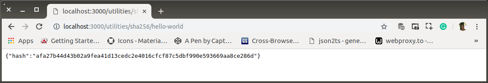
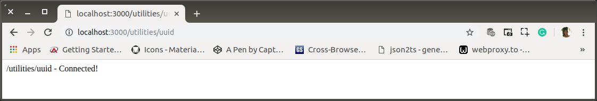
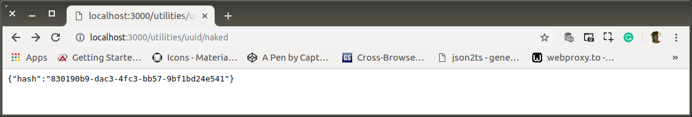

# ae-00-utilities.md

`Selasa, 16 Juli 2019`

**`20:03`**

Penyediaan middleware `js-sha256` dan `uuid-random`

## `js-sha256`

0. Route

    ```bash
    $ # app-root
    $ mkdir routes/utilities/sha256 && touch routes/utilities/sha256/index.js
    ```

    `routes/utilities/sha256/index.js`

    ```javascript
    'use-strict';

    var sha256 = require('express').Router()

    sha256.get('/', (req, res) => {
        res.send('/utilities/sha256 - Connected!');
    });

    module.exports = sha256;
    ```

**`20:34`**

**`22:58`**

1. Register ke `routes/utilities`

    `routes/utilities/index.js`

    ```javascript
    'use-strict';

    var utilities = require('express').Router(),
        sha256 = require('./sha256');

    utilities.use("/sha256", sha256);

    utilities.get('/', (req, res) => {
        res.send('/utilities - Connected!');
    });

    module.exports = utilities;
    ```

    `http://localhost:3000/utilities/sha256`

    <p align="center">
        
        <br />Figure: ae-00-a-utilities-sha256.png
    </p>

2. Middleware

    ```bash
    $ # app-root
    $ touch routes/utilities/sha256/sha256.js
    ```

    `routes/utilities/sha256/sha256.js`

    ```javascript
    'use-strict';

    var sha256 = require('js-sha256').sha256;

    module.exports = (req, res) => {
        hash = sha256(req.params.data);
        res.status(200).json({ hash });
    };
    ```

    `http://localhost:3000/utilities/sha256/hello-world`

    <p align="center">
        
        <br />Figure: ae-00-b-utilities-sha256.png
    </p>

## `uuid-random`

0. Route

    ```bash
    $ # app-root
    $ mkdir routes/utilities/uuid && touch routes/utilities/uuid/index.js
    ```

    `routes/utilities/uuid/index.js`

    ```javascript
    'use-strict';

    var uuid = require('express').Router()

    uuid.get('/', (req, res) => {
        res.send('/utilities/uuid - Connected!');
    });

    module.exports = uuid;
    ```

1. Register ke `routes/utilities`

    `routes/utilities/index.js`

    ```javascript
    'use-strict';

    var utilities = require('express').Router(),
        sha256 = require('./sha256'),
        uuid = require('./uuid');

    utilities.use("/uuid", uuid);

    utilities.use("/sha256", sha256);

    utilities.get('/', (req, res) => {
        res.send('/utilities - Connected!');
    });

    module.exports = utilities;
    ```

    `http://localhost:3000/utilities/uuid`

    <p align="center">
        
        <br />Figure: ae-00-c-utilities-uuid.png
    </p>

2. Middleware

    Middleware untuk UUID yang pertama-kali ini dibuat telanjang. Di masa yang akan datang dapat dibubuhi data kunci tertentu dan/atau waktu.

    ```bash
    $ # app-root
    $ touch routes/utilities/uuid/naked.js
    ```

    `routes/utilities/uuid/naked.js`

    ```javascript
    'use-strict';

    var sha256 = require('js-sha256').sha256;

    module.exports = (req, res) => {
        hash = uuid();
        res.status(200).json({ hash });
    };
    ```

3. Register ke `routes/utilities/uuid`

    `routes/utilities/uuid/index.js`

    ```javascript
    'use-strict';

    var uuid = require('express').Router(),
        naked = require('./naked');

    uuid.get('/naked', naked);

    uuid.get('/', (req, res) => {
        res.send('/utilities/uuid - Connected!');
    });

    module.exports = uuid;
    ```

    `http://localhost:3000/utilities/uuid/naked`

    <p align="center">
        
        <br />Figure: ae-00-d-utilities-uuid-naked.png
    </p>

**`00:33`**