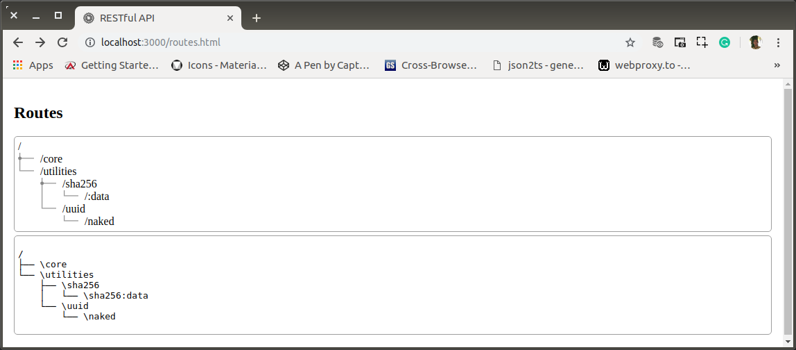
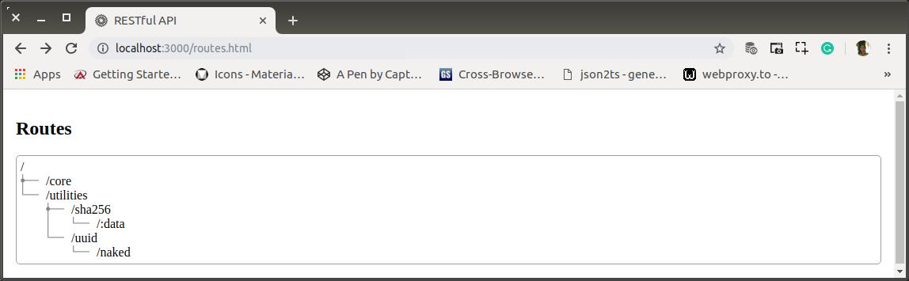
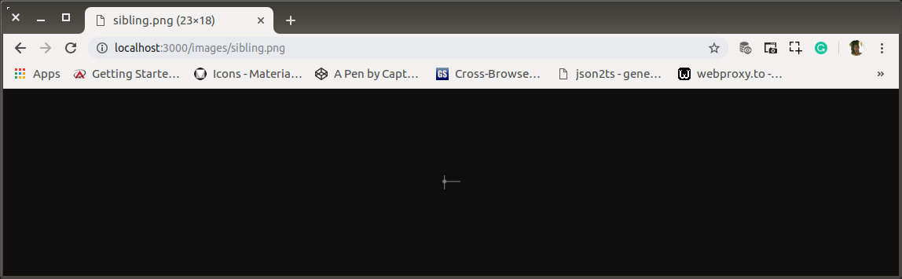

# ae-01-utilities-basepoint-redirect.md

`Kamis, 18 Juli 2019`

**`10:05`**

Pada saat route mulai terlihat kompleks, harus ada upaya untuk membantu mengingat sebuah route. Di subversion ini, saya akan mengalihkan ke layanan static jika user memberikan url yang merupakan base-point. Jadi dalam satu domain, satu port, dapat melayani sebagaimana layaknya RESTful API Server dan sekaligus dapat melayani permintaan HTML beserta semua MIME files yang dikandungnya.

## Serve Static HTML

Untuk kepentingan ini, saya mendapatkan guide dari https://www.hacksparrow.com/webdev/express/how-to-server-static-html-files.html. 

Express.js comes with a badass HTML pre-processor, Jade, but sometimes you may just want to use the good old HTML files for whatever reason. Is there a way to accomplish this? Oh yes, there is!

The short and quick answer to this requirement is - dump the files in the public directory!

There is a slightly more elaborate but cleaner method, which will help you from cluttering up your public directory with the HTML files - use the static middleware.

## Preparation

0. Create the public with routes.html in it.

    ```bash
    $ # app-root
    $ mkdir -p public/images/boiler
    $ touch public/routes.html
    ```

1. Membuat `.svg` sederhana untuk `favicon` dengan bantuan `inkscape GUI`.

    Saya mengambil gambar dari https://www.flaticon.com/free-icons/sunflower, dibenahi dengan `inkscape` dan langsung di-ekspor ke `favicon.png`

    Direktori kerja di `public/images/boiler`

2. Kemudian `favicon.png` di-convert dalam berbagai ukuran (16, 60, 76, 120, 152).

    ```bash
    $ # app-root
    $ cd public/images/boiler
    $ convert favicon.png -resize 16x16 16.png
    $ convert favicon.png -resize 60x60 60.png
    $ convert favicon.png -resize 76x76 76.png
    $ convert favicon.png -resize 120x120 120.png
    $ convert favicon.png -resize 152x152 152.png

    ```

3. Dan akhirnya semua hasilnya (`.png`) di-merge ke favicon.ico dan diletakkan di `/public/images` bersama-sama dengan file-file `.png` yang bersangkutan.

    Pembuatan `.ico` dibantu oleh `icoutils`

    ```bash
    $ sudo apt-get install icoutils
    ```

    ```bash
    $ # public/images/boiler
    $ icotool -c 16.png 60.png 76.png 120.png 152.png -o favicon.ico
    $ cp favicon.ico ../
    ```

4. Untuk menunjukkan `routes-tree`, saya buat tiga images

    - sibling.png
    - continue.png
    - end.png

    Semuanya diletakkan di `/public/images`

## HTML 

0. Membuat `routes.html`

    `routes.html`

    ```html
    <!doctype html>
    <html lang="en">

    <head>
        <meta charset="utf-8">
        <title>RESTful API</title>
        <base href="/">

        <meta name="viewport" content="user-scalable=no, width=device-width, initial-scale=1, maximum-scale=1">
        <meta http-equiv="cache-control" content="no-cache, must-revalidate, post-check=0, pre-check=0">
        <meta http-equiv="expires" content="0">
        <meta http-equiv="pragma" content="no-cache">
        <link rel="icon" type="image/x-icon" href="images/favicon.ico">
        <style>
            body {
                margin: 0;
                padding: 0;
            }
        
            .pad16 {
                padding: 16px;
            }
        
            .paragraph {
                padding: 5px;
                border: 1px solid rgb(158, 158, 158);
                margin-bottom: 5px;
            }
        
            .paragraph.radius-5 {
                -moz-border-radius: 5px;
                -webkit-border-radius: 5px;
                border-radius: 5px;
            }
        
            .sibling {
                padding-left: 32px;
                background-image: url("images/sibling.png");
                background-repeat: no-repeat;
            }
        
            .end {
                padding-left: 32px;
                background-image: url("images/end.png");
                background-repeat: no-repeat;
            }
        
            .continue {
                padding-left: 32px;
                background-image: url("images/continue.png");
                background-repeat: no-repeat;
            }
        
            .space {
                width: 32px;
            }
        
            .flex {
                display: flex;
            }
        </style>
    </head>

    <body>
        <div class="pad16">
            <h2>Routes</h2>
            <div class="pad16 paragraph radius-5">
                /
                <div class="sibling">/core</div>
                <div class="end">/utilities</div>
                <div class="flex">
                    <div class="space"></div>
                    <div class="sibling">/sha256</div>
                </div>
                <div class="flex">
                    <div class="space"></div>
                    <div class="continue"></div>
                    <div class="end">/:data</div>
                </div>
                <div class="flex">
                    <div class="space"></div>
                    <div class="end">/uuid</div>
                </div>
                <div class="flex">
                    <div class="space"></div>
                    <div class="space"></div>
                    <div class="end">/naked</div>
                </div>
                <div class="pad16 paragraph radius-5">
    <pre>
    /
    &#x251C&#x2500&#x2500 \core
    &#x2514&#x2500&#x2500 \utilities
    &nbsp;&nbsp;&nbsp;&nbsp;&#x251C&#x2500&#x2500 \sha256
    &nbsp;&nbsp;&nbsp;&nbsp;&#x2502&nbsp;&nbsp;&nbsp;&#x2514&#x2500&#x2500 \sha256:data
    &nbsp;&nbsp;&nbsp;&nbsp;&#x2514&#x2500&#x2500 \uuid
    &nbsp;&nbsp;&nbsp;&nbsp;&nbsp;&nbsp;&nbsp;&nbsp;&#x2514&#x2500&#x2500 \naked
    </pre>
            </div>
        </div>
    </body>

    </html>
    ```

    **Note:**
    Jika HTML file dibuat sederhana, penulisan extended ASII character adalah alternative yang dapat dipilih. Nomor charater berpedoman pada https://en.wikipedia.org/wiki/Code_page_437.

1. Pointing to a `/public`

    `/index.js`

    ```javascript
    'use strict';

    var app = require('express')(),
        express = require('express'),
        port = process.env.PORT || 3000,
        bodyParser = require('body-parser'),
        routes = require('./routes'),
        path = require('path');

    global.staticBase = path.resolve(__dirname + '/public');
    app.use(express.static(staticBase));

    app.use(bodyParser.urlencoded({ extended: true }));
    app.use(bodyParser.json());

    app.use(function (req, res, next) {
        res.header("Access-Control-Allow-Origin", "*");
        res.header("Access-Control-Allow-Headers", "Origin, X-Requested-With, Content-Type, Accept");
        next();
    });

    app.use('/', routes);

    app.listen(port, () => {
        console.log('');
        console.log('"BPR" Field Working Performance System');
        console.log('RESTful API Server run di PORT: ' + port);
    });
    ```

2. Update the base-point of `/routes`

    `/routes/index.js`

    ```javascript
    'use strict';

    var routes = require('express').Router(),
        core = require('./core'),
        utilities = require('./utilities');

    routes.use('/utilities', utilities);

    routes.use('/core', core);

    routes.get('/', (req, res) => {
        res.sendFile(staticBase + '/routes.html');
    });

    module.exports = routes;
    ```

3. Test Static URL

    Dengan tambahan tampilan ASCII character
    
    <p align="center">
        
        <br />Figure: ae-01-a-html-for-basepoint.png
    </p>

    Setelah bagian alternative dengan ASII character dieliminasi

    <p align="center">
        
        <br />Figure: ae-01-b-html-for-basepoint.png
    </p>

    Walau gelap :), images dapat pula diakses lewat static URL.

    <p align="center">
        
        <br />Figure: ae-01-c-sibling.png
    </p>

> NOTE:
>
> `routes.html` dapat disempurnakan dan disesuaikan dengan themes dari aplikasi utama yang menggunakan RESTfull API Server ini.
>
> Test di atas dibuat sebelum menyediakan routes untuk assets. Routes dibuat setelah seluruh base-point ter-update.

## Update All Base-Point

Semua base-point yang sudah ada, langsung di arahkan ke `routes.html`

0. `/routes/core/index.js`

    ```javascript
    'use-strict';

    var core = require('express').Router()

    core.get('/', (req, res) => {
        res.sendFile(staticBase + '/routes.html');
    });

    module.exports = core;
    ```

1. `/routes/utilities/index.js`

    ```javascript
    'use-strict';

    var utilities = require('express').Router(),
        sha256 = require('./sha256'),
        uuid = require('./uuid');

    utilities.use("/uuid", uuid);

    utilities.use("/sha256", sha256);

    utilities.get('/', (req, res) => {
        res.sendFile(staticBase + '/routes.html');
    });

    module.exports = utilities;
    ```

2. `/routes/utilities/sha256/index.js`

    ```javascript
    'use-strict';

    var sha256 = require('express').Router(),
        middleware = require('./sha256.js');

    sha256.get('/:data', middleware);

    sha256.get('/', (req, res) => {
        res.sendFile(staticBase + '/routes.html');
    });

    module.exports = sha256;
    ```

3. `/routes/utilities/uuid/index.js`

    ```javascript
    'use-strict';

    var uuid = require('express').Router(),
        naked = require('./naked');

    uuid.get('/naked', naked);

    uuid.get('/', (req, res) => {
        res.sendFile(staticBase + '/routes.html');
    });

    module.exports = uuid;
    ```

4. Done!

    Base-point URL

    <p align="center">
        
        <br />Figure: ae-01-d-utilities-basepoint.png
    </p>

`Jum'at, 19 Juli 2019`

**`20:44`**

Saya menambahkan font style untuk body dengan,

```scss
body {
    margin: 0;
    padding: 0;
    font-family: 'Roboto', sans-serif;
}
```

**`20:54`**