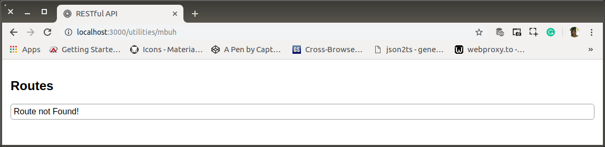

# ae-02-utilities-error.md

`Jum'at, 19 Juli 2019`

**`20:56`**

Terinspirasi dari basepoint-redirect dan kemudian setelah membaca tutorial berikut : https://www.geeksforgeeks.org/nodejs-handling-invalid-routes/ dan terutama ini: https://gist.github.com/zcaceres/2854ef613751563a3b506fabce4501fd, saya akan membuat error-handling yang 'terbaca'.

0. Menyiapkan `error.html`

    ```bash
    $ #app-root
    $ touch public/error.html
    ```

    ```html
<!doctype html>
<html lang="en">

<head>
	<meta charset="utf-8">
	<title>RESTful API</title>
	<base href="/">

	<meta name="viewport" content="user-scalable=no, width=device-width, initial-scale=1, maximum-scale=1">
	<meta http-equiv="cache-control" content="no-cache, must-revalidate, post-check=0, pre-check=0">
	<meta http-equiv="expires" content="0">
	<meta http-equiv="pragma" content="no-cache">
	<link rel="icon" type="image/x-icon" href="images/favicon.ico">
	<style>
		body {
			margin: 0;
			padding: 0;
			font-family: 'Roboto', sans-serif;
		}

		.pad16 {
			padding: 16px;
		}

		.paragraph {
			padding: 5px;
			border: 1px solid rgb(158, 158, 158);
			margin-bottom: 5px;
		}

		.paragraph.radius-5 {
			-moz-border-radius: 5px;
			-webkit-border-radius: 5px;
			border-radius: 5px;
		}

		.sibling {
			padding-left: 32px;
			background-image: url("images/sibling.png");
			background-repeat: no-repeat;
		}

		.end {
			padding-left: 32px;
			background-image: url("images/end.png");
			background-repeat: no-repeat;
		}

		.continue {
			padding-left: 32px;
			background-image: url("images/continue.png");
			background-repeat: no-repeat;
		}

		.space {
			width: 32px;
		}

		.flex {
			display: flex;
		}
	</style>
</head>

<body>
	<div class="pad16">
		<h2>Routes</h2>
		<div class="pad16 paragraph radius-5">
			Route not Found!
		</div>
	</div>
</body>
    ```

1. Redirecting di `/routes/index.js`

    ```javascript
    'use strict';

    var routes = require('express').Router(),
        core = require('./core'),
        utilities = require('./utilities');

    routes.use('/utilities', utilities);

    routes.use('/core', core);

    routes.get('/', (req, res) => {
        res.sendFile(staticBase + '/routes.html');
    });

    routes.get('*', (req, res) => {
        res.sendFile(staticBase + '/error.html');
    });

    module.exports = routes;
    ```

    Redireksi cukup dilakukan di `/routes/index.js` sudah akan mencakup seluruh invalid routes.

2. Test!

    <p align="center">
        
        <br />Figure: ae-02-a-html-for-error.png
    </p>

**`20:59`**