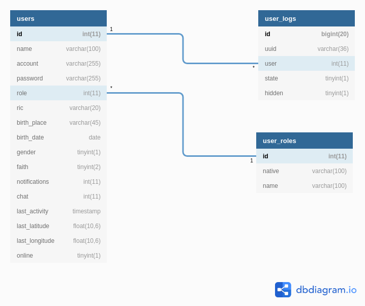
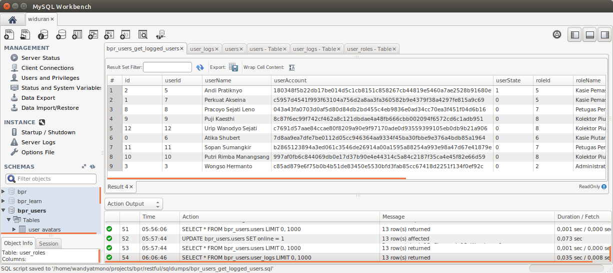
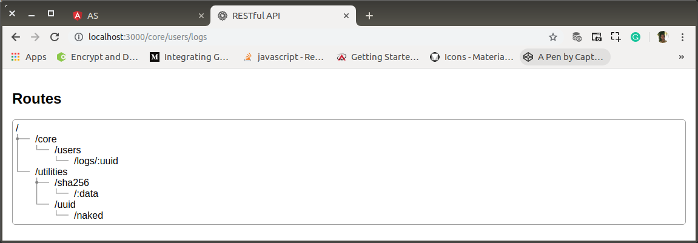
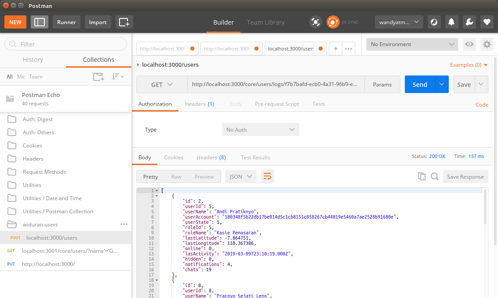
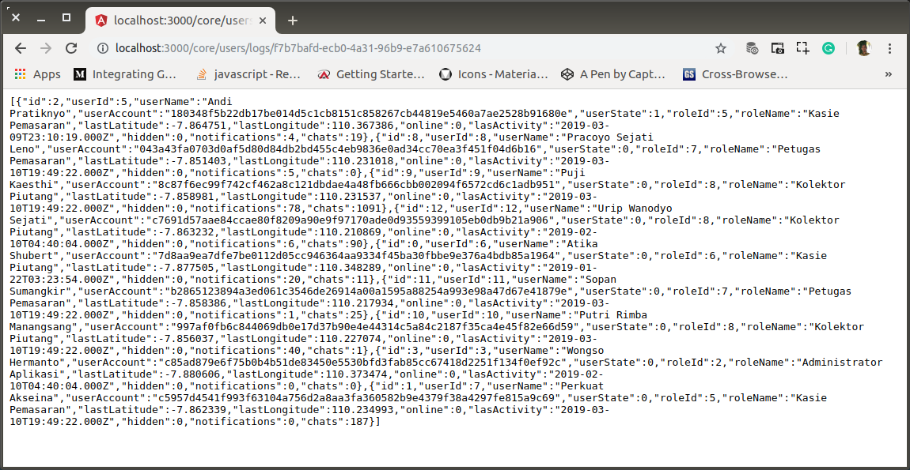

# af-01-users-for-bootstrap.md

`Jum'at, 19 Juli 2019`

**`21:30`**

`Rabu, 31 Juli 2019`

**`22:12`**

Pada saat bootstrap, ada request dari `frontend` yang harus dipenuhi. Yaitu daftar logged-users. Oleh karena itu, dalam subversion ini akan disediakan routes dan middleware untuk menerima request dari `frontend`.

Permintaan data yang dikehendaki tercermin dari sebuah `frontend` interface berikut ini:

`LoggedusersInterface`

```typescript
export interface UserLogs {
    id: number;
    userId: number;
    userName: string;
    userAccount: string;
    userState: number;
    roleId: number;
    roleName: string; 
    lastLatitude: number;
    lastLongitude: number;
    online: boolean;
    lastActivity: timestamp;
    hidden: boolean;
    notifications: number;
    chats: number;
}
```

## Data

Sebagaimana dengan seharusnya, `user_logs` table adalah sebuah transaction-table yang memiliki dependensi terhadap actor dari system, yaitu users.

0. Code Pembentuk Relational Schema Diagram

    ```sql
    Table users {
        id int(11) [pk, NOT NULL]
        name varchar(100)
        account varchar(255)
        password varchar(255)
        role int(11)
        ric varchar(20)
        birth_place varchar(45)
        birth_date date
        gender tinyint(1)
        faith tinyint(2)
        notifications int(11)
        chat int(11)
        last_activity timestamp
        last_latitude float(10,6)
        last_longitude float(10,6)
        online tinyint(1)
    }

    Table user_logs {
        id bigint(20) [pk, NOT NULL]
        uuid varchar(36)
        user int(11)
        state tinyint(1)
        hidden tinyint(1)
    }

    Table user_roles {
        id int(11) [pk, NOT NULL]
        native varchar(100)
        name varchar(100)
    }

    Ref: users.role > user_roles.id
    Ref: users.id < user_logs.user
    ```

    `users` table adalah perekam data perihal main-actors dalam aplikasi.

    fields:

    Sebagai primary-key, `id` harus autoincrement.
    `ric` (residential identity card), `name`, `birth_date`, `birth_place`, `gender` dan `faith` adalah id user di real-world.
    `role` adalah peran user pada aplikasi. Sesuai bidang tugas dan kewajiban masing-masing dalam struktur manajemen.
    `account` dan `password` dibutuhkan sebagai alat authentikasi.
    `notifications` dan `chats` adalah catatan aplikasi tentang jumlah notifications dan chats yang belum terbaca.
    `last_activity` mencatat waktu aktivitas user yang terakhir. Yaitu saat melakukan akses apa saja terhadap `backend`.
    `last_latitude` dan `last_longitude` adalah posisi user terakhir saat online.

    `user_logs` adalah perekam semua user yang sedang logged di sebuah client. 

    fields:

    `id`, primary key, autoincrement.
    `uuid` adalah id dari client (browser).
    `user` adalah user yang logged di sebuah browser pada client dengan `uuid` yang terkait.
    `state` adalah kondisi user saat logged. Bisa dalam keadaan signed-in atau tidak.
    `hidden` mencatat permintaan user terhadap aplikasi. Ingin tersembunyi sebagai user, ataukah tidak.

    `user_roles` adalah perekam nama-nama roles untuk users.

    fields

    `id`, primary key, autoincrement.
    `native`, nama dalam english.
    `name`, nama dalam bahasa.

1. Relational Shemma Diagram

    <p align="center">
        
        <br />Figure: af-01-a-user-logs-relational-schemma.png
    </p>

2. Sqls and dummies

    `users`

    ```sql
    CREATE DATABASE  IF NOT EXISTS `bpr_users`;
    USE `bpr_users`;

    DROP TABLE IF EXISTS `user_logs`;
    CREATE TABLE `user_logs` (
    `id` bigint(20) NOT NULL AUTO_INCREMENT,
    `uuid` varchar(36) DEFAULT NULL,
    `user` int(11) DEFAULT NULL,
    `state` tinyint(1) DEFAULT NULL,
    `hidden` tinyint(1) DEFAULT NULL,
    PRIMARY KEY (`id`),
    KEY `fk_user_logs_1_idx` (`user`),
    CONSTRAINT `fk_user_logs_1` FOREIGN KEY (`user`) REFERENCES `users` (`id`) ON DELETE NO ACTION ON UPDATE NO ACTION
    ) ENGINE=InnoDB AUTO_INCREMENT=13 DEFAULT CHARSET=latin1;

    LOCK TABLES `user_logs` WRITE;
    INSERT INTO `user_logs` VALUES 
        (0,'f7b7bafd-ecb0-4a31-96b9-e7a610675624',6,1,1),
        (1,'f7b7bafd-ecb0-4a31-96b9-e7a610675624',7,1,1),
        (2,'f7b7bafd-ecb0-4a31-96b9-e7a610675624',5,0,1),
        (3,'f7b7bafd-ecb0-4a31-96b9-e7a610675624',3,1,1),
        (4,'abd16e0c-7a9b-4cba-bdc7-230535b983cd',2,1,1),
        (5,'201746b2-9088-4d7a-bbc7-5915d52874e0',3,1,1),
        (6,'da3e812b-b5f8-4e9f-a629-30e0907a4e5b',1,1,1),
        (7,'da3e812b-b5f8-4e9f-a629-30e0907a4e5b',4,1,1),
        (8,'f7b7bafd-ecb0-4a31-96b9-e7a610675624',8,1,1),
        (9,'f7b7bafd-ecb0-4a31-96b9-e7a610675624',9,1,1),
        (10,'f7b7bafd-ecb0-4a31-96b9-e7a610675624',10,1,1),
        (11,'f7b7bafd-ecb0-4a31-96b9-e7a610675624',11,1,1),
        (12,'f7b7bafd-ecb0-4a31-96b9-e7a610675624',12,1,0);
    UNLOCK TABLES;

    DROP TABLE IF EXISTS `users`;
    CREATE TABLE `users` (
        `id` int(11) NOT NULL AUTO_INCREMENT,
        `name` varchar(100) COLLATE utf8_unicode_ci DEFAULT NULL,
        `account` varchar(255) CHARACTER SET utf8 DEFAULT NULL,
        `password` varchar(255) CHARACTER SET utf8 DEFAULT NULL,
        `role` int(11) DEFAULT NULL,
        `ric` varchar(20) CHARACTER SET utf8 DEFAULT NULL,
        `birth_place` varchar(45) COLLATE utf8_unicode_ci DEFAULT NULL,
        `birth_date` date DEFAULT NULL,
        `gender` tinyint(1) DEFAULT NULL,
        `faith` tinyint(2) DEFAULT NULL,
        `notifications` int(11) DEFAULT '0',
        `chats` int(11) DEFAULT '0',
        `last_activity` timestamp NULL DEFAULT NULL,
        `last_latitude` float(10,6) DEFAULT NULL,
        `last_longitude` float(10,6) DEFAULT NULL,
        `online` tinyint(1) DEFAULT '0',
        PRIMARY KEY (`id`),
        KEY `fk_users_1` (`role`),
        KEY `fk_users_2_idx` (`faith`),
        KEY `fk_users_3_idx` (`gender`),
        CONSTRAINT `fk_users_1` FOREIGN KEY (`role`) REFERENCES `user_roles` (`id`) ON DELETE NO ACTION ON UPDATE NO ACTION,
        CONSTRAINT `fk_users_2` FOREIGN KEY (`faith`) REFERENCES `user_religions` (`id`) ON DELETE NO ACTION ON UPDATE NO ACTION,
        CONSTRAINT `fk_users_3` FOREIGN KEY (`gender`) REFERENCES `user_gender` (`id`) ON DELETE NO ACTION ON UPDATE NO ACTION
    ) ENGINE=InnoDB AUTO_INCREMENT=14 DEFAULT CHARSET=utf8 COLLATE=utf8_unicode_ci;

    LOCK TABLES `users` WRITE;
    INSERT INTO `users` VALUES
        (1,'Joko Wandyatmono','bf59af91aeb8306261c665d5c9b50941f5242c94245ce7d3bc92bebae7e3d5b1','bf59af91aeb8306261c665d5c9b50941f5242c94245ce7d3bc92bebae7e3d5b1',1,'1234567890123456','Solo','1961-06-23',1,1,4,10,'2019-03-10 19:49:22',-7.881796,110.375526,0),
        (2,'Lani Husadawati','41d2b587f0f0497acd9f17293d22f45f54bc5f0726a3f3d4edf426fe384c11dd','41d2b587f0f0497acd9f17293d22f45f54bc5f0726a3f3d4edf426fe384c11dd',4,'1234567890123456','Solo','1986-08-17',0,2,5,101,'2019-03-09 23:10:19',-7.870682,110.373856,0),
        (3,'Wongso Hermanto','c85ad879e6f75b0b4b51de83450e5530bfd3fab85cc67418d2251f134f0ef92c','c85ad879e6f75b0b4b51de83450e5530bfd3fab85cc67418d2251f134f0ef92c',2,'1234567890123456','Solo','1970-10-15',1,3,0,0,'2019-02-10 04:40:04',-7.880606,110.373474,0),
        (4,'Yusnita Sri Sundari','e28bc14ef7ee01d17147dd302d552645fa7f4df30b05349c8b4099494475cd10','e28bc14ef7ee01d17147dd302d552645fa7f4df30b05349c8b4099494475cd10',3,'1234567890123456','Sukoharjo','1990-04-28',0,1,23,298,'2019-03-10 19:49:22',-7.865708,110.367065,0),
        (5,'Andi Pratiknyo','180348f5b22db17be014d5c1cb8151c858267cb44819e5460a7ae2528b91680e','180348f5b22db17be014d5c1cb8151c858267cb44819e5460a7ae2528b91680e',5,'1234567890123456','Tangerang','1970-07-25',1,2,4,19,'2019-03-09 23:10:19',-7.864751,110.367386,0),
        (6,'Atika Shubert','7d8aa9ea7dfe7be0112d05cc946364aa9334f45ba30fbbe9e376a4bdb85a1964','7d8aa9ea7dfe7be0112d05cc946364aa9334f45ba30fbbe9e376a4bdb85a1964',6,'1234567890123456','Klaten','1981-02-13',1,2,20,11,'2019-01-22 03:23:54',-7.877505,110.348289,0),
        (7,'Perkuat Akseina','c5957d4541f993f63104a756d2a8aa3fa360582b9e4379f38a4297fe815a9c69','c5957d4541f993f63104a756d2a8aa3fa360582b9e4379f38a4297fe815a9c69',5,'1234567890123456','Malang','1981-07-17',0,2,0,187,'2019-03-10 19:49:22',-7.862339,110.234993,0),
        (8,'Pracoyo Sejati Leno','043a43fa0703d0af5d80d84db2bd455c4eb9836e0ad34cc70ea3f451f04d6b16','043a43fa0703d0af5d80d84db2bd455c4eb9836e0ad34cc70ea3f451f04d6b16',7,'1234567890123456','Solo','1980-06-12',0,2,5,0,'2019-03-10 19:49:22',-7.851403,110.231018,0),
        (9,'Puji Kaesthi','8c87f6ec99f742cf462a8c121dbdae4a48fb666cbb002094f6572cd6c1adb951','8c87f6ec99f742cf462a8c121dbdae4a48fb666cbb002094f6572cd6c1adb951',8,'1234567890123456','Solo','1986-01-27',1,2,78,1091,'2019-03-10 19:49:22',-7.858981,110.231537,0),
        (10,'Putri Rimba Manangsang','997af0fb6c844069db0e17d37b90e4e44314c5a84c2187f35ca4e45f82e66d59','997af0fb6c844069db0e17d37b90e4e44314c5a84c2187f35ca4e45f82e66d59',8,'1234567890123456','Mataram','1987-09-10',1,2,40,1,'2019-03-10 19:49:22',-7.856037,110.227074,0),
        (11,'Sopan Sumangkir','b2865123894a3ed061c3546de26914a00a1595a88254a993e98a47d67e41879e','b2865123894a3ed061c3546de26914a00a1595a88254a993e98a47d67e41879e',7,'1234567890123456','Sibolga','1979-08-17',0,2,1,25,'2019-03-10 19:49:22',-7.858386,110.217934,0),
        (12,'Urip Wanodyo Sejati','c7691d57aae84ccae80f8209a90e9f97170ade0d93559399105eb0db9b21a906','c7691d57aae84ccae80f8209a90e9f97170ade0d93559399105eb0db9b21a906',8,'1234567890123456','Yogya','1987-03-02',1,2,6,90,'2019-02-10 04:40:04',-7.863232,110.210869,0),
        (13,'Fredddy Paloh','51eeed7251f3f56288ee554afaa1028b7fbc3daacc4a952be4ae8d18ddaf3320','51eeed7251f3f56288ee554afaa1028b7fbc3daacc4a952be4ae8d18ddaf3320',7,'1234567890123456','Bogor','1970-10-16',1,2,0,0,'2019-03-09 23:10:19',-7.866251,110.259621,0);
    UNLOCK TABLES;

    DROP TABLE IF EXISTS `user_roles`;
    CREATE TABLE `user_roles` (
    `id` int(11) NOT NULL AUTO_INCREMENT,
    `native` varchar(100) COLLATE utf8_unicode_ci DEFAULT NULL,
    `name` varchar(100) CHARACTER SET utf8 DEFAULT NULL,
    PRIMARY KEY (`id`)
    ) ENGINE=InnoDB AUTO_INCREMENT=9 DEFAULT CHARSET=utf8 COLLATE=utf8_unicode_ci;

    LOCK TABLES `user_roles` WRITE;
    INSERT INTO `user_roles` VALUES
        (1,'Developer','Pengembang'),(2,'Application Administrator','Administrator Aplikasi'),(3,'Head of Investment Division','Kabag Investasi'),(4,'Head of Receivables Division','Kabag Piutang'),(5,'Section Chief of Marketing','Kasie Pemasaran'),(6,'Section Chief of Receivables','Kasie Piutang'),(7,'Marketing Officer','Petugas Pemasaran'),(8,'Receivable Collector','Kolektor Piutang');
    UNLOCK TABLES;
    ```

3. Percobaan pemberian sql untuk menampilkan informasi lengkap user yang logged pada sebuah client dengan data kunci `uuid`

    ```sql
    USE
        bpr_users;
    SELECT
        ul.id AS id,
        ul.user AS userId,
        u.name AS userName,
        u.account AS userAccount,
        ul.state AS userState,
        u.role AS roleId,
        ur.name AS roleName,
        u.last_latitude AS lastLatitude,
        u.last_longitude AS lastLongitude,
        u.online,
        u.last_activity AS lasActivity,
        ul.hidden,
        u.notifications,
        u.chats
    FROM
        user_logs AS ul
    JOIN
        users AS u
    ON
        ul.user=u.id AND ul.uuid='f7b7bafd-ecb0-4a31-96b9-e7a610675624'
    JOIN
        user_roles AS ur
    ON
        u.role = ur.id
    ORDER BY
        ul.state DESC;
    ```

    <p align="center">
        
        <br />Figure: af-01-b-user-logs.png
    </p>

## Routes and Middleware

0. Buat pedoman routes di `routes.html`

    ```html
    <!doctype html>
    <html lang="en">

    <head>
        <meta charset="utf-8">
        <title>RESTful API</title>
        <base href="/">

        <meta name="viewport" content="user-scalable=no, width=device-width, initial-scale=1, maximum-scale=1">
        <meta http-equiv="cache-control" content="no-cache, must-revalidate, post-check=0, pre-check=0">
        <meta http-equiv="expires" content="0">
        <meta http-equiv="pragma" content="no-cache">
        <link rel="icon" type="image/x-icon" href="images/favicon.ico">
        <style>
            body {
                margin: 0;
                padding: 0;
                font-family: 'Roboto', sans-serif;
            }
        
            .pad16 {
                padding: 16px;
            }
        
            .paragraph {
                padding: 5px;
                border: 1px solid rgb(158, 158, 158);
                margin-bottom: 5px;
            }
        
            .paragraph.radius-5 {
                -moz-border-radius: 5px;
                -webkit-border-radius: 5px;
                border-radius: 5px;
            }
        
            .sibling {
                padding-left: 32px;
                background-image: url("images/sibling.png");
                background-repeat: no-repeat;
            }
        
            .end {
                padding-left: 32px;
                background-image: url("images/end.png");
                background-repeat: no-repeat;
            }
        
            .continue {
                padding-left: 32px;
                background-image: url("images/continue.png");
                background-repeat: no-repeat;
            }
        
            .space {
                width: 32px;
            }
        
            .flex {
                display: flex;
            }
        </style>
    </head>

    <body>
        <div class="pad16">
            <h2>Routes</h2>
            <div class="pad16 paragraph radius-5">
                /
                <div class="sibling">/core</div>
                <div class="flex">
                    <div class="continue"></div>
                    <div class="end">/users</div>
                </div>
                <div class="flex">
                    <div class="continue"></div>
                    <div class="space"></div>
                    <div class="end">/logs/:uuid</div>
                </div>
                <div class="end">/utilities</div>
                <div class="flex">
                    <div class="space"></div>
                    <div class="sibling">/sha256</div>
                </div>
                <div class="flex">
                    <div class="space"></div>
                    <div class="continue"></div>
                    <div class="end">/:data</div>
                </div>
                <div class="flex">
                    <div class="space"></div>
                    <div class="end">/uuid</div>
                </div>
                <div class="flex">
                    <div class="space"></div>
                    <div class="space"></div>
                    <div class="end">/naked</div>
                </div>
            </div>
        </div>
    </body>
    ```

    <p align="center">
        
        <br />Figure: af-01-c-user-logs-route.png
    </p>
    
1. `users` basepoint

    `/routes/core/users`

    ```javascript
    'use-strict';

    var users = require('express').Router(),
        logs = require('./logs');

    users.use('/logs', user_logs);

    users.get('/', (req, res) => {
        res.sendFile(staticBase + '/routes.html');
    });

    module.exports = users;
    ```

2. `logs` basepoint

    ```bash
    $ # app-root
    $ mkdir routes/core/users/logs
    $ touch routes/core/users/logs/index.js
    ```

    ```javascript
    'use-strict';

    var logs = require('express').Router();

    var middleware = require('./logs.js');

    logs.get('/:uuid', middleware);

    logs.get('/', (req, res) => {
        res.sendFile(staticBase + '/routes.html');
    });

    module.exports = logs;
    ```

3. Middleware

    `routes/core/users/logs

    ```javascript
    'use-strict';

    var db = require('../../../../connection');

    module.exports = (req, res) => {
        var uuid = req.params.uuid;
        var sql =   'SELECT ' +
                    '   ul.id AS id, ' +
                    '   ul.user AS userId, ' +
                    '   u.name AS userName, ' +
                    '   u.account AS userAccount, ' +
                    '   ul.state AS userState, ' +
                    '   u.role AS roleId, ' +
                    '   ur.name AS roleName, ' +
                    '   u.last_latitude AS lastLatitude, ' +
                    '   u.last_longitude AS lastLongitude, ' +
                    '   u.online, ' +
                    '   u.last_activity AS lastActivity, ' +
                    '   ul.hidden, ' +
                    '   u.notifications, ' +
                    '   u.chats ' +
                    'FROM ' +
                    '   user_logs AS ul ' +
                    'JOIN ' +
                    '   users AS u ' +
                    'ON ' +
                    '   ul.user = u.id AND ul.uuid = ? ' +
                    'JOIN ' +
                    '   user_roles AS ur ' +
                    'ON ' +
                    '   u.role = ur.id ' +
                    'ORDER BY ' +
                    '   ul.state DESC; ';
        db.query(
            sql,
            [ uuid ], 
            function (error, rows, fields){
                if(error){
                    console.log(error)
                } else{
                    res.send(rows)
                }
            }
        );
    };
    ```

    <p align="center">
        
        <br />Figure: af-01-d-user-logs.png
    </p>

    <p align="center">
        
        <br />Figure: af-01-e-user-logs.png
    </p>

`Minggu, 4 Agustus 2019`

**`23:54`**