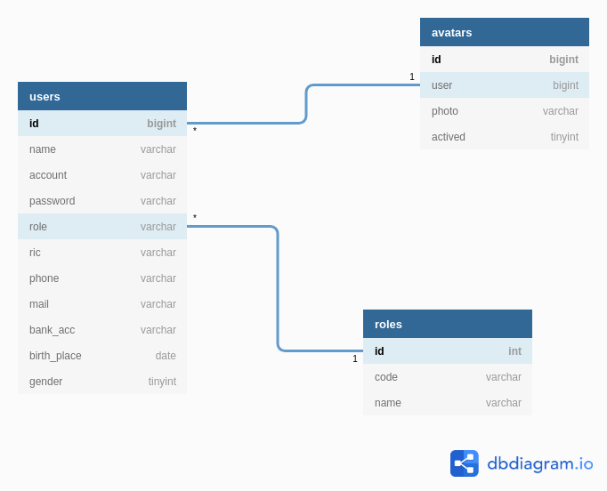

# af-01-users-relational-schema.md

`Jum'at, 19 Juli 2019`

**`21:47`**

**`23:28`**

Kebutuhan penting aplikasi terhadap ketersediaan data adalah database dengan tabel `users` dan beberapa reference-tables. Untuk sementara ini, tabel `roles` dan `avatars`.

Saya harus dapat membuat relational-schema untuk ketiga tabel di atas. Baru kemudian diiukti dengan pembuatan tabel-tabel yang terlibat.

Setelah browsing ke sana kemari, akhirnya saya menemukan alat yang tepat untuk database design. Online, gratis, multi-type export, code-based.

Feature yang terakhir adalah feature yang paling menarik. `CODE-BASED`.

Situsnya di `https://dbdiagram.io/d`.

## Users, Roles, & Avatars

0. Code

    Saved as `users`

    ```bash
    Table users {
    id bigint [pk, not null]
    name varchar 
    account varchar
    password varchar
    role varchar
    ric varchar
    phone varchar
    mail varchar
    bank_acc varchar
    birth_place date
    gender tinyint
    }

    Table avatars {
    id bigint [pk, not null]
    user bigint
    photo varchar
    actived tinyint
    }

    Table roles {
    id int [pk, not null]
    code varchar
    name varchar
    }

    Ref: users.id > avatars.user
    Ref: users.role > roles.id
    ```

1. Diagram

    <p align="center">
        
        <br />Figure: af-01-a-users-relational-schema.png
    </p>

2. Generating SQL

    Designer milik dbdiagram.io hanya saya gunakan untuk membuat relational schema. Pembangunan database dan tabel saya lakukan secara manual dengan bantuan MySQL Workbench agar akurasi data, type, dan ukuran dapat diperoleh.

    Berikut adalah exported SQL yang saya peroleh setelah pembangunan.

    `BPR` schema (database)

    ```sql
    CREATE DATABASE  IF NOT EXISTS `bpr`
    USE `bpr`;
    ```

    `users` table

    ```sql
    CREATE DATABASE  IF NOT EXISTS `bpr`
    USE `bpr`;

    DROP TABLE IF EXISTS `users`;
    CREATE TABLE `users` (
        `id` bigint(20) NOT NULL AUTO_INCREMENT,
        `name` varchar(64) COLLATE utf8_unicode_ci DEFAULT NULL,
        `account` varchar(256) CHARACTER SET utf8 DEFAULT NULL,
        `password` varchar(256) CHARACTER SET utf8 DEFAULT NULL,
        `role` varchar(4) CHARACTER SET utf8 DEFAULT NULL,
        `ric` varchar(16) CHARACTER SET utf8 DEFAULT NULL,
        `bank_acc` varchar(45) COLLATE utf8_unicode_ci DEFAULT NULL,
        `birth_place` varchar(45) COLLATE utf8_unicode_ci DEFAULT NULL,
        `birth_date` date DEFAULT NULL,
        `gender` tinyint(1) DEFAULT NULL,
        PRIMARY KEY (`id`)
    ) ENGINE=InnoDB AUTO_INCREMENT=13 DEFAULT CHARSET=utf8 COLLATE=utf8_unicode_ci;

    LOCK TABLES `users` WRITE;
    INSERT INTO `users` VALUES 
        (
            1,
            'Freddy Paloh',
            '51eeed7251f3f56288ee554afaa1028b7fbc3daacc4a952be4ae8d18ddaf3320',
            '51eeed7251f3f56288ee554afaa1028b7fbc3daacc4a952be4ae8d18ddaf3320',
            '0000',
            '1234567890123456',
            '12345678901234',
            'Bogor',
            '1970-10-15',
            1
        ),(
            2,
            'Lani Husadawati',
            '41d2b587f0f0497acd9f17293d22f45f54bc5f0726a3f3d4edf426fe384c11dd',
            '41d2b587f0f0497acd9f17293d22f45f54bc5f0726a3f3d4edf426fe384c11dd',
            '0001',
            '1234567890123456',
            '12345678901234',
            'Solo',
            '1986-08-17',
            0
        ),(
            3,
            'Wongso Hermanto',
            'c85ad879e6f75b0b4b51de83450e5530bfd3fab85cc67418d2251f134f0ef92c',
            'c85ad879e6f75b0b4b51de83450e5530bfd3fab85cc67418d2251f134f0ef92c',
            '0002',
            '1234567890123456',
            '12345678901234',
            'Solo',
            '1970-10-15',
            1
        ),(
            4,
            'Yusnita Sri Sundari',
            'e28bc14ef7ee01d17147dd302d552645fa7f4df30b05349c8b4099494475cd10',
            'e28bc14ef7ee01d17147dd302d552645fa7f4df30b05349c8b4099494475cd10',
            '0003',
            '1234567890123456',
            '12345678901234',
            'Sukoharjo',
            '1990-04-28',
            0
        ),(
            5,
            'Andi Pratiknyo',
            '180348f5b22db17be014d5c1cb8151c858267cb44819e5460a7ae2528b91680e',
            '180348f5b22db17be014d5c1cb8151c858267cb44819e5460a7ae2528b91680e',
            '0004',
            '1234567890123456',
            '12345678901234',
            'Tangerang',
            '1970-07-25',
            1
        ),(
            6,
            'Atika Shubert',
            '7d8aa9ea7dfe7be0112d05cc946364aa9334f45ba30fbbe9e376a4bdb85a1964',
            '7d8aa9ea7dfe7be0112d05cc946364aa9334f45ba30fbbe9e376a4bdb85a1964',
            '1000',
            '1234567890123456',
            '12345678901234',
            'Klaten',
            '1981-02-13',
            1
        ),(
            7,
            'Perkuat Akseina',
            'c5957d4541f993f63104a756d2a8aa3fa360582b9e4379f38a4297fe815a9c69',
            'c5957d4541f993f63104a756d2a8aa3fa360582b9e4379f38a4297fe815a9c69',
            '2000',
            '1234567890123456',
            '12345678901234',
            'Malang',
            '1981-07-17',
            0
        ),(
            8,
            'Pracoyo Sejati Leno',
            '043a43fa0703d0af5d80d84db2bd455c4eb9836e0ad34cc70ea3f451f04d6b16',
            '043a43fa0703d0af5d80d84db2bd455c4eb9836e0ad34cc70ea3f451f04d6b16',
            '3000',
            '1234567890123456',
            '12345678901234',
            'Solo',
            '1980-06-12',
            0
        ),(
            9,
            'Puji Kaesthi',
            '8c87f6ec99f742cf462a8c121dbdae4a48fb666cbb002094f6572cd6c1adb951',
            '8c87f6ec99f742cf462a8c121dbdae4a48fb666cbb002094f6572cd6c1adb951',
            '1100',
            '1234567890123456',
            '12345678901234',
            'Solo',
            '1986-01-27',
            1
        ),(
            10,
            'Putri Rimba Manangsang',
            '997af0fb6c844069db0e17d37b90e4e44314c5a84c2187f35ca4e45f82e66d59',
            '997af0fb6c844069db0e17d37b90e4e44314c5a84c2187f35ca4e45f82e66d59',
            '1200',
            '1234567890123456',
            '12345678901234',
            'Mataram',
            '1987-09-10',
            1
        ),(
            11,
            'Sopan Sumangkir',
            'b2865123894a3ed061c3546de26914a00a1595a88254a993e98a47d67e41879e',
            'b2865123894a3ed061c3546de26914a00a1595a88254a993e98a47d67e41879e',
            '2100',
            '1234567890123456',
            '12345678901234',
            'Sibolga',
            '1979-08-17',
            0
        ),(
            12,
            'Urip Wanodyo Sejati',
            'c7691d57aae84ccae80f8209a90e9f97170ade0d93559399105eb0db9b21a906',
            'c7691d57aae84ccae80f8209a90e9f97170ade0d93559399105eb0db9b21a906',
            '2200',
            '1234567890123456',
            '12345678901234',
            'Yogya',
            '1987-03-02',
            1
        );
    UNLOCK TABLES;
    ```

    `roles` table

    ```sql
    CREATE DATABASE  IF NOT EXISTS `bpr`
    USE `bpr`;
    DROP TABLE IF EXISTS `roles`;
    CREATE TABLE `roles` (
        `id` int(11) NOT NULL AUTO_INCREMENT,
        `code` varchar(4) CHARACTER SET utf8 NOT NULL,
        `name` varchar(100) CHARACTER SET utf8 DEFAULT NULL,
        PRIMARY KEY (`id`)
    ) ENGINE=InnoDB AUTO_INCREMENT=22 DEFAULT CHARSET=utf8 COLLATE=utf8_unicode_ci;

    LOCK TABLES `roles` WRITE;
    INSERT INTO `roles` VALUES 
        (1,'0000','Dewan Komisaris'),
        (2,'0001','Direktur Utama'),
        (3,'0002','Komite Kredit'),
        (4,'0003','Sekretaris'),
        (5,'1000','General Manager'),
        (6,'1100','Kabag Marketing Lending'),
        (7,'1110','TL 1 Marketing Lending'),
        (8,'1111','A/O 1 Marketing Lending'),
        (9,'1120','TL 2 Marketing Lending'),
        (10,'1121','A/O 2 Marketing Lending'),
        (11,'1200','Kabag Marketing Funding'),
        (12,'1210','Staff Marketing Funding'),
        (13,'2000','Direktur Kepatuhan'),
        (14,'2100','Kabag HRD dan GA'),
        (15,'2110','Staff HRD dan GA'),
        (16,'2120','Security dan OB'),
        (17,'2200','Kabag Kepatuhan RM'),
        (18,'2210','Staff Kepatuhan RM'),
        (19,'2300','Kabag Legal'),
        (20,'2310','Staff Legal'),
        (21,'3000','Direktur Operasional'),
        (22,'3100','Kabag Accounting'),
        (23,'3110','Staff Accounting'),
        (24,'3200','Kabag IT'),
        (25,'3210','Staff IT'),
        (26,'3300','Branch Manager'),
        (27,'3310','Kabag Operasional'),
        (28,'3311','Customer Service'),
        (29,'3312','Admin Kredit'),
        (30,'3313','Back Office'),
        (31,'3314','Teller'),
        (32,'3315','Appraisal'),
        (33,'3400','Kabag Audit Intern'),
        (34,'3410','Staff Audit Intern');
    UNLOCK TABLES;
    ```

    `avatars` table

    ```sql
    CREATE DATABASE  IF NOT EXISTS `bpr`
    USE `bpr`;
    DROP TABLE IF EXISTS `avatars`;
    CREATE TABLE `avatars` (
        `id` bigint(20) NOT NULL AUTO_INCREMENT,
        `user` bigint(20) DEFAULT NULL,
        `photo` varchar(255) COLLATE utf8_unicode_ci DEFAULT NULL,
        `actived` tinyint(4) DEFAULT '0',
        PRIMARY KEY (`id`)
    ) ENGINE=InnoDB AUTO_INCREMENT=13 DEFAULT CHARSET=utf8 COLLATE=utf8_unicode_ci;

    LOCK TABLES `avatars` WRITE;
    INSERT INTO `avatars` VALUES 
        (1,1,'freddy_paloh.jpg',0),
        (2,2,'lani_husadawati.jpg',0),
        (3,3,'wongso_hermanto.jpg',0),
        (4,4,'yusnita_sri_sundari.jpg',0),
        (5,5,'andi_pratiknyo.jpg',0),
        (6,6,'atika_shubert.jpg',0),
        (7,7,'perkuat_akseina.jpg',0),
        (8,8,'pracoyo_sejati_leno.jpg',0),
        (9,9,'puji_kaesthi.jpg',0),
        (10,10,'putri_rimba_manangsang.jpg',0),
        (11,11,'sopan_sumangkir.jpg',0),
        (12,12,'urip_wanodyo_sejati.jpg',0);
    UNLOCK TABLES;
    ```

3. Data Request SQL

    ```sql
    SELECT
        u.id, u.name, u.account, u.password, u.role, r.name AS position, u.ric, u.bank_acc, u.birth_place, u.birth_date, gender, a.photo AS avatar, a.actived
    FROM bpr.users AS u
    JOIN bpr.roles AS r
    JOIN bpr.avatars AS a
    ON u.role=r.code AND u.id=a.user
    ```

    Telah dicoba dan diperiksa di https://www.piliapp.com/mysql-syntax-check/

`Sabtu, 20 Juli 2019`

**`04:32`**