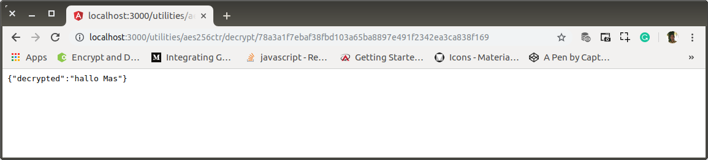

# af-02-users-aes256.md

`account` pada `users` akan saya ganti dengan enkripsi aes-256-ctr. Untuk kepentingan tersebut saya menggunakan sebuah library bernama **cryptr**. Kerjanya hanya mengenkripsi dan mendeskripsi dalam format aes-256-ctr saja. Simple.

Di dapat di https://www.npmjs.com/package/cryptr.

cryptr is a simple aes-256-ctr encrypt and decrypt module for node.js

It is for doing simple encryption of values UTF-8 strings that need to be decrypted at a later time.

If you require anything more than that you probably want to use something more advanced or crypto directly.

The Cryptr constructor takes 1 required argument.

Cryptr(secret)

The iv is randomly generated and prepended to the result

DO NOT USE THIS MODULE FOR ENCRYPTING PASSWORDS!

Password seharusnya menggunakan HASH. Bukan enkripsi.

## Install

```bash
$ npm install cryptr --save
```

## Usage

```javascript
const Cryptr = require('cryptr');
const cryptr = new Cryptr('myTotalySecretKey');
 
const encryptedString = cryptr.encrypt('bacon');
const decryptedString = cryptr.decrypt(encryptedString);
 
console.log(encryptedString); // 5590fd6409be2494de0226f5d7
console.log(decryptedString); // bacon
```

Walaupun dapat dilakukan di `frontend`, sebagaimana API untuk UUID dan SHA256, layanan ini hanya dilakukan di `backend`.

## Route dan Middleware

0. Routes

    ```bash
    $ # app-root
    $ mkdir routes/utilities/aes256ctr
    $ touch routes/utilities/aes256ctr/index.js

    $ mkdir routes/utilities/aes256ctr/encrypt
    $ touch routes/utilities/aes256ctr/encrypt/index.js
    $ touch routes/utilities/aes256ctr/encrypt/encrypt.js

    $ mkdir routes/utilities/aes256ctr/decrypt
    $ touch routes/utilities/aes256ctr/decrypt/index.js
    $ touch routes/utilities/aes256ctr/decrypt/decrypt.js
    ```

    `routes.html`

    ```html
    <!doctype html>
    <html lang="en">

    <head>
        <meta charset="utf-8">
        <title>RESTful API</title>
        <base href="/">

        <meta name="viewport" content="user-scalable=no, width=device-width, initial-scale=1, maximum-scale=1">
        <meta http-equiv="cache-control" content="no-cache, must-revalidate, post-check=0, pre-check=0">
        <meta http-equiv="expires" content="0">
        <meta http-equiv="pragma" content="no-cache">
        <link rel="icon" type="image/x-icon" href="images/favicon.ico">
        <style>
            body {
                margin: 0;
                padding: 0;
                font-family: 'Roboto', sans-serif;
            }
        
            .pad16 {
                padding: 16px;
            }
        
            .paragraph {
                padding: 5px;
                border: 1px solid rgb(158, 158, 158);
                margin-bottom: 5px;
            }
        
            .paragraph.radius-5 {
                -moz-border-radius: 5px;
                -webkit-border-radius: 5px;
                border-radius: 5px;
            }
        
            .sibling {
                padding-left: 32px;
                background-image: url("images/sibling.png");
                background-repeat: no-repeat;
            }
        
            .end {
                padding-left: 32px;
                background-image: url("images/end.png");
                background-repeat: no-repeat;
            }
        
            .continue {
                padding-left: 32px;
                background-image: url("images/continue.png");
                background-repeat: no-repeat;
            }
        
            .space {
                width: 32px;
            }
        
            .flex {
                display: flex;
            }
        </style>
    </head>

    <body>
        <div class="pad16">
            <h2>Routes</h2>
            <div class="pad16 paragraph radius-5">
                /
                <div class="sibling">/core</div>
                <div class="flex">
                    <div class="continue"></div>
                    <div class="end">/users</div>
                </div>
                <div class="flex">
                    <div class="continue"></div>
                    <div class="space"></div>
                    <div class="end">/logs</div>
                </div>
                <div class="flex">
                    <div class="continue"></div>
                    <div class="space"></div>
                    <div class="space"></div>
                    <div class="end">/:data</div>
                </div>
                <div class="end">/utilities</div>
                <div class="flex">
                    <div class="space"></div>
                    <div class="sibling">/sha256</div>
                </div>
                <div class="flex">
                    <div class="space"></div>
                    <div class="continue"></div>
                    <div class="end">/:data</div>
                </div>
                <div class="flex">
                    <div class="space"></div>
                    <div class="sibling">/uuid</div>
                </div>
                <div class="flex">
                    <div class="space"></div>
                    <div class="continue"></div>
                    <div class="end">/naked</div>
                </div>
                <div class="flex">
                    <div class="space"></div>
                    <div class="end">/aes356ctr</div>
                </div>
                <div class="flex">
                    <div class="space"></div>
                    <div class="space"></div>
                    <div class="sibling">/encrypt</div>
                </div>
                <div class="flex">
                    <div class="space"></div>
                    <div class="space"></div>
                    <div class="continue"></div>
                    <div class="end">/:data</div>
                </div>
                <div class="flex">
                    <div class="space"></div>
                    <div class="space"></div>
                    <div class="end">/decrypt</div>
                </div>
                <div class="flex">
                    <div class="space"></div>
                    <div class="space"></div>
                    <div class="space"></div>
                    <div class="end">/:data</div>
                </div>
            </div>
        </div>
    </body>
    ```

1. Register to `/routes/utilities`

    `/routes/utilities/index.js`

    ```javascript
    'use-strict';

    var utilities = require('express').Router(),
        sha256 = require('./sha256'),
        uuid = require('./uuid'),
        aes256ctr = require('./aes256ctr');

    utilities.use("/aes256ctr", aes256ctr);

    utilities.use("/uuid", uuid);

    utilities.use("/sha256", sha256);

    utilities.get('/', (req, res) => {
        res.sendFile(staticBase + '/routes.html');
    });

    module.exports = utilities;
    ```

2. `aes256ctr` routes

    `routes/utilities/aes256ctr/index.js`

    ```javascript
    'use-strict';

    var aes256ctr = require('express').Router(),
        encrypt = require('./encrypt'),
        decrypt = require('./decrypt');

    aes256ctr.use('/encrypt', encrypt);

    aes256ctr.use('/decrypt', decrypt);

    aes256ctr.get('/', (req, res) => {
        res.sendFile(staticBase + '/routes.html');
    });

    module.exports = aes256ctr;
    ```

3. `encrypt` routes

    `routes/utilities/aes256ctr/encrypt/index.js`

    ```javascript
    'use-strict';

    var encrypt = require('express').Router(),
        middleware = require('./encrypt.js');

    encrypt.get('/:data', middleware);

    encrypt.get('/', (req, res) => {
        res.sendFile(staticBase + '/routes.html');
    });

    module.exports = encrypt;
    ```

4. `encrypt` middleware

    `routes/utilities/aes256ctr/encrypt/encrypt.js`

    ```javascript
    'use-strict';

    var Cryptr = require('cryptr');
    const cryptr = new Cryptr('joko@wandyatmono');

    module.exports = (req, res) => {
        encrypted = cryptr.encrypt(req.params.data);
        res.status(200).json({ encrypted });
    };
    ```

5. `decrypt` routes

    `routes/utilities/aes256ctr/decrypt/index.js`

    ```javascript
    'use-strict';

    var decrypt = require('express').Router(),
        middleware = require('./decrypt.js');

    decrypt.get('/:data', middleware);

    decrypt.get('/', (req, res) => {
        res.sendFile(staticBase + '/routes.html');
    });

    module.exports = decrypt;
    ```

6. `decrypt` middleware

    `routes/utilities/aes256ctr/decrypt/decrypt.js`

    ```javascript
    'use-strict';

    var Cryptr = require('cryptr');
    const cryptr = new Cryptr('joko@wandyatmono');

    module.exports = (req, res) => {
        try {
            decrypted = cryptr.decrypt(req.params.data);
        } catch (ex) {
            decrypted = "Ops, Bad input string!";
        }
        res.status(200).json({ decrypted });
    };
    ```

4. Test

    <p align="center">
        
        <br />Figure: af-02-a-encrypt
    </p>

    <p align="center">
        
        <br />Figure: af-02-b-decrypt.png
    </p>

    <p align="center">
        
        <br />Figure: af-02-c-routes.png
    </p>
    
**`05:08`**