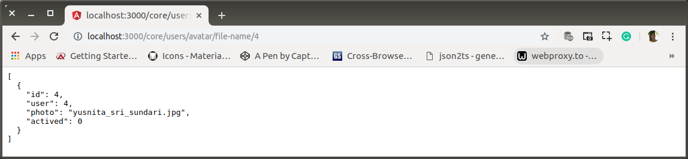
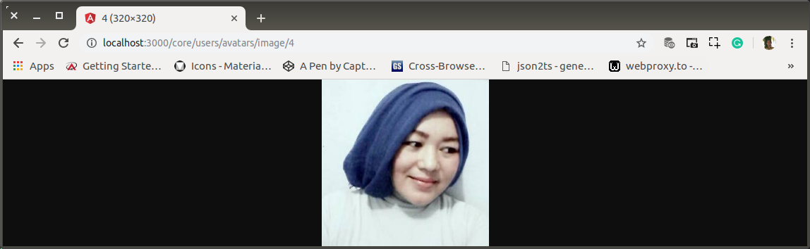

# af-03-users-get-single-avatar.md

`Minggu, 21 Juli 2019`

**`15:07`**

Get Single Avatar File Name.

Avatar adalah bagian dari user's profile. Kedudukannya penting dari sisi UX.

## Single Avatar with `id` middleware

0. Menambahkan base-point baru di `routes/core/users`

    ```bash
    $ # app-root
    $ mkdir routes/core/users/avatars
    $ touch routes/core/users/avatars/index.js
    ```

1. Register

    `routes/core/users/index.js`

    ```javascript
    'use-strict';

    var users = require('express').Router(),
        all = require('./all.js'),
        allLimit = require('./all-pagination'),
        singleId = require('./single-id.js'),
        avatars = require('./avatars');

    users.get('/single-id/:id', singleId);

    users.get('/all/:fromAfter/:asManyAs', allLimit);

    users.get('/all', all);

    users.use('/avatars', avatars);

    users.get('/', (req, res) => {
        res.sendFile(staticBase + '/routes.html');
    });

    module.exports = users;
    ```

2. base-point

    `/routes/core/users/avatars/index.js`

    ```javascript
    'use-strict';

    var avatars = require('express').Router();

    avatars.get('/', (req, res) => {
        res.sendFile(staticBase + '/routes.html');
    });

    module.exports = avatars;
    ```

4. Middleware

    ```bash
    $ # app-root
    $ touch routes/core/users/avatar/file-name.js
    ```

    SQL:

    ```sql
    SELECT * FROM bpr.avatars as a
    WHERE a.user = id;
    ```

    `/routes/core/users/avatar/file-name.js`

    ```javascript
    'use-strict';

    var db = require('../../../../connection'),
        beautify = require("json-beautify");

    module.exports = (req, res) => {
        query = 'SELECT * ' +
            'FROM bpr.avatars AS a ' +
            'WHERE a.user = ' + req.params.id + ';';
        db.query(
            query, function (error, rows, fields) {
                if (error) {
                    console.log(error);
                } else {
                    res.header("Content-Type", 'application/json');
                    res.send(beautify(rows, null, 2, 50));
                }
            }
        );
    };
    ```

    Tracing Path menuju ke `connection.js` harus relative. Karena berada di luar local module, saya tidak dapat menggunakan global variable. Terpaksa menggunakan `../../../../` Semakin dalam root, akan semakin panjang.

    Output utama yang dihasilkan adalah `photo` property dari data `avatar`.

5. Register

    `/routes/core/users/avatars/index.js`

    ```javascript
    'use-strict';

    var avatars = require('express').Router(),
        fileName = require('./file-name.js');

    avatars.get('/file-name/:id', fileName);

    avatars.get('/', (req, res) => {
        res.sendFile(staticBase + '/routes.html');
    });

    module.exports = avatars;
    ```

4. Test

    <p align="center">
        
        <br />Figure: af-03-a-avatar-file-name.png
    </p>

    Informasi yang diberikan akan berguna jika `frontend` akanmenayangkan image di `` tag.

## GET Image Buffer, API controller updates

0. Generate

    ```bash
    $ # app-root
    $ touch routes/core/users/avatars/image.js
    ```

1. Register

    `routes/core/users/avatars/index.js`

    ```javascript
    'use-strict';

    var avatars = require('express').Router(),
        fileName = require('./file-name.js'),
        image = require('./image.js');

    avatars.get('/image/:id', image);

    avatars.get('/file-name/:id', fileName);

    avatars.get('/', (req, res) => {
        res.sendFile(staticBase + '/routes.html');
    });

    module.exports = avatars;
    ```

2. Prepare avatar's images

    Lokasi dibuat di `public` (`staticBase`). Tempat yang tepat untuk `frontend` user meng-upload avatar mereka.

    ```bash
    $ # app-root
    $ mkdir -p public/media/images/photos/profiles/avatars
    ```

    Semua avatars untuk para dummy users diletakkan.

2. Build

    `routes/core/users/avatars/image.js`

    ```javascript
    'use-strict';

    var db = require('../../../../connection'),
        fs = require('fs');

    function getFileName(id) {

        imgPath = staticBase + '/media/images/photos/profiles/avatars/';

        return new Promise(resolve => {
            var query = 'SELECT photo ' +
                        'FROM avatars ' +
                        'WHERE user = ? && actived = 0;';
            db.query(query,
                [id],
                function (error, rows, fields) {
                    if (error) {
                        resolve(error);
                    } else {
                        rows[0].photo = imgPath + rows[0].photo;
                        resolve(rows[0].photo);
                    }
                }
            );
        });
    }

    module.exports = async (req, res) => {

        var id = req.params.id;

        let fileName = await getFileName(id);
        avatar = fs.readFileSync(fileName);
        res.end(avatar);
    };
    ```
    This controller, require `fs` to fulfill the task.

1. Test

    <p align="center">
        
        <br />Figure: af-03-b-avatar-image.png
    </p> 

## Deliver Right Sized Image

Pelayanan kepada client harus sesuai dengan size yang diminta. Oleh karena itu perlu perubahan pada `routes/core/users/profiles`, yaitu menerima parameter `size`

0. Update route

    `routes/core/users/avatars/index.js`

    ```javascript
    'use-strict';

    var avatars = require('express').Router(),
        fileName = require('./file-name.js'),
        image = require('./image.js');

    avatars.get('/image/:id/:size', image);

    avatars.get('/file-name/:id', fileName);

    avatars.get('/', (req, res) => {
        res.sendFile(staticBase + '/routes.html');
    });

    module.exports = avatars;
    ```

1. Update middleware to process the request

    `routes/core/users/avatars/image.js`

    ```javascript
    'use-strict';

    var response = require('../../../../responses'),
        db = require('../../../../db_engine'),
        fs = require('fs');

    function getFileName(id){
        
        imgPath = 'assets/images/photos/profiles/avatar/';

        return new Promise(resolve => {
            var query = 'SELECT photo FROM avatars WHERE user = ? && last_end_usage IS NULL';
            db.query(query,
                [ id ], 
                function (error, rows, fields){
                    if(error){
                        resolve(error);
                    } else{
                        rows[0].photo = imgPath + rows[0].photo;
                        resolve(rows[0].photo ); 
                    }
                }
            );
        });
    }

    module.exports = async (req, res) => {

        var id = req.params.id;
        var size = req.params.size;

        let fileName = await getFileName(id);

        let avatarWidth = 0; 
        let avatarHeight = 0;

        switch (size) {
            case 'S': {
                avatarWidth = 28;
                avatarHeight = 28;
                break;
            }
            case 'M': {
                avatarWidth = 48;
                avatarHeight = 48;
                break;
            }
            case 'L': {
                avatarWidth = 64;
                avatarHeight = 64;
                break;
            }
            case 'XL': {
                avatarWidth = 128;
                avatarHeight = 128;
                break;
            }
            case 'XXL': {
                avatarWidth = 256;
                avatarHeight = 256;
                break;
            }

        }

        avatar = fs.readFileSync(avatarFileName);
        res.end(avatar);
    };
    ```

    Tidak ada manipulasi ukuran di sini. Sumber image tetap sama dan hasil yang dikirim ke client tentunya masih memiliki ukuran yang sama dengan sumbernya.

## Image Manipulation with JIMP

Untuk memenuhi image request dengan dimensi tertentu, harus dibantu dengan library khusus untuk image processing.

Saya memilih library yang tidak memiliki dependencies apapun, baik terhadap library lain maupun yang bekerja di system level seperti misalnya `imageMagick`.

Saya berhasil menemukan satu di antara beberapa tawaran di internet. Yaitu [JIMP](https://www.npmjs.com/package/jimp)

0. Download

    ```bash
    $ npm install --save jimp
    ```

1. Update

    Saya belum banyak mempelajari JIMP, jadi saya hanya melihat contoh. Tetapi implementasi yang sesuai dengan algorithm pattern yang saya terapkan di API middleware saya belum saya temukan. Sehingga saya hanya menduga-duga. Dan berharap dapat mengatasi masalah interkoneksi dengan client. Terutama tentang bagaimana mengakses manipulated-image dari client.

    Kebetulan JIMP memberlakukan obyek manipulasi sebagai original image. Image yang 'dibaca' akan dimanipulasi dan diletakkan di memory dalam bentuk binary (image buffer). Atau dengan kata lain, hasil baca akan di resolve dalam bentuk image buffer.

    Dengan bantuan JIMP, 'fs' tidak diperlukan lagi.

    Ini adalah salah satu [inspirator](https://github.com/oliver-moran/jimp/issues/141) saya dalam memahami hal tersebut.

    ```javascript
    'use-strict';

    var response = require('../../../../responses'),
        db = require('../../../../db_engine'),
        jimp = require('jimp');

    function getFileName(id) {
        
        imgPath = 'assets/images/photos/profiles/avatar/';

        return new Promise(resolve => {
            var query = 'SELECT photo FROM avatars WHERE user = ? && last_end_usage IS NULL';
            db.query(query,
                [ id ], 
                function (error, rows, fields){
                    if(error){
                        resolve(error);
                    } else{
                        rows[0].photo = imgPath + rows[0].photo;
                        resolve(rows[0].photo ); 
                    }
                }
            );
        });
    }

    function avatarBuffer(avatar, avatarWidth, avatarHeight) {

        return new Promise(resolve => {
            jimp.read(avatar, (err, avatar) => {
                if (err) throw err;
                avatar
                    .resize(avatarWidth, avatarHeight)
                    .quality(60)
                avatar.getBuffer(avatar._originalMime, (err, buffer) => {
                    if (err) reject(err)
                    resolve(buffer)
                })
                
            });
        });
    }

    module.exports = async (req, res) => {

        var id = req.params.id;
        var size = req.params.size;

        let fileName = await getFileName(id);

        let avatarWidth = 0; 
        let avatarHeight = 0;

        switch (size) {
            case 'S': {
                avatarWidth = 28;
                avatarHeight = 28;
                break;
            }
            case 'M': {
                avatarWidth = 48;
                avatarHeight = 48;
                break;
            }
            case 'L': {
                avatarWidth = 64;
                avatarHeight = 64;
                break;
            }
            case 'XL': {
                avatarWidth = 128;
                avatarHeight = 128;
                break;
            }
            case 'XXL': {
                avatarWidth = 256;
                avatarHeight = 256;
                break;
            }

        }

        let avatar = await avatarBuffer(fileName, avatarWidth, avatarHeight);
        res.writeHead(200, {'Content-Type': 'image/jpg' });
        res.end(avatar);
        
    };
    ```

2. Test

    <p align="center">
        
        <br />Figure: af-03-c-avatar-image-medium.png
    </p> 

> NOTE
>
> Saya belum dapat mengatasi jika API controller ini mengalami 'not-found'. Sebab MySQL tidak throwing error sehingga saat logic melangkah lebih jauh akan terjadi non mysql error.

**`20:41`**
