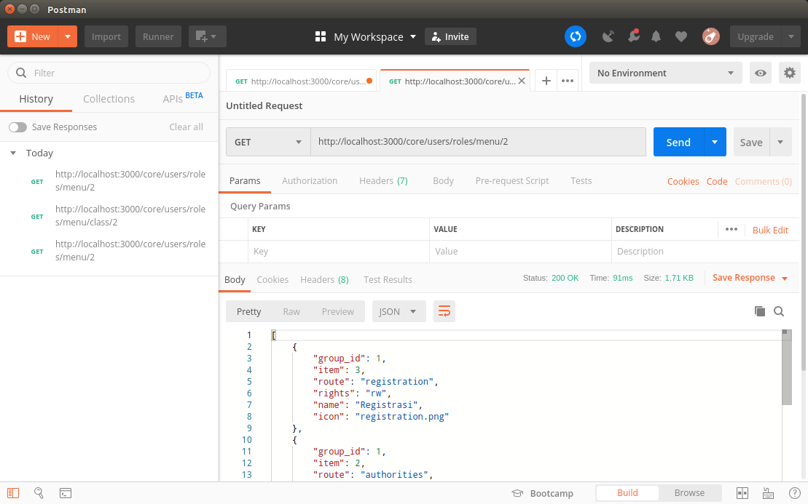

# ag-01-auth-generate-menu.md

`Senin, 21 Agustus 2019`

**`12:15`**

Dan sebelum mulai masuk ke hal-hal terkait dengan security, saya akan mulai dengan menyusun middleware untuk memberi layanan terkait dengan pembuatan menu di `frontend`. Menu yang sesuai dengan `role` dari seorang user.

Ada dua middleware yang harus disediakan. Satu untuk mengambil menu dari sebuah role, dan satu lagi untuk menu-group dari menu yang bersangkutan. Sangat berguna untuk menyusun menu di 'sidenav'.

## Menu Design

User yang akan berhubungan dengan aplikasi adalah sebagai berikut:

Developer                       Pengembang
Application Administrator       Administrator Aplikasi 

Head of Investment Division     Kabag Investasi
Head of Receivable Division     Kabag Piutang
Section Chief of Marketing      Kasie Pemasaran
Section Chief of Receivable     Kasi Piutang
Marketing Officer               Petugas Pemasaran
Receivable Collector            Kolektor Piutang

Jabatan di atas, oleh aplikasi disebut dengan role.

User memiliki hak akses atau autoritas atas layanan yang tersedia di aplikasi berdasarkan role yang disandangnya. Dengan kata lain, setiap fitur aplikasi hakikatnya adalah layanan terhadap user dengan role tertentu. 

**`1 Administration/Administrasi`**
    `1 Role Structure/Struktur Peran`
    `2 Authorities/Autoritas` 
    `3 Registration/Registrasi`
    `4 Delegation/Delegasi`
**`2 Taskforce Performance/Kinerja Gugus Tugas`**
    `1 Marketing Report`
    `2 Receivables Report`
    `3 Taskforce Mobility Report`
    `4 Personal Mobility Report`
    `5 Achievement Report`
**`3 Personal Activities/Aktivitas Pribadi`**
    `1 Profile/Profil`
    `2 Command Chains/Rantai Komando`
    `3 Intercom/Interkom`
         
**`Human Resources/SDM`**
    `Role Structure/Struktur Peran`
        Pengaturan nama-nama struktur peran dalam Gugus Tugas
    `Authorities/Autoritas` 
        Pengaturan otoritas terkait dengan peran dalam Gugus Tugas
    `Registration/Registrasi`
        Pendaftaran Anggota Gugus Tugas
    `Delegation/Delegasi`
        Penyematan peran dalam Gugus Tugas
**`Taskforce Performance/Kinerja Gugus Tugas`**
    `Marketing Report`
        Laporan Pemasaran per Gugus Tugas terkait dengan target
    `Receivables Report`
        Laporan Piutang per Gugus Tugas terkait dengan target
    `Taskforce Mobility Report`
        Laporan mobilitas seluruh Gugus Tugas, dan sebuah Gugus Tugas
    `Personal Mobility Report`
        Laporan mobilitas per Officer/Collector
    `Achievement Report`
        Laporan Pencapaian per Officer/Collector
**`Personal Activities/Aktivitas Pribadi`**
    `Profile/Profil`
        Pengaturan Profile Pribadi
    `Calendar/Kalender`
        Pengaturan Kalender
    `Command Chains/Rantai Komando`
        Komunikasi Rantai Komando
    `Intercom/Interkom`
        Komunikasi informal antar struktur peran dalam tugas

Melihat dari susunan fitur aplikasi di atas terlihat jelas perihal aplikasi yang harus disusun.

## Database Design 

0. Relational Diagram

    <p align="center">
        
        <br />Figure: ag-01-a-relational-schema.png
    </p>

1. Sql Design

    ```sql
    USE bpr_users

    CREATE TABLE `user_roles` (
        `id` int(11) PRIMARY KEY NOT NULL AUTO_INCREMENT,
        `native` varchar(100),
        `name` varchar(100)
    );

    CREATE TABLE `role_duty_groups` (
        `id` int(11) PRIMARY KEY NOT NULL AUTO_INCREMENT,
        `native` varchar(100),
        `name` varchar(100)
    );

    CREATE TABLE `role_duties` (
        `id` int(11) PRIMARY KEY NOT NULL AUTO_INCREMENT,
        `role` int(11),
        `item` int(11),
        `right` varchar(2)
    );

    CREATE TABLE `role_duty_list` (
        `id` int(11) PRIMARY KEY NOT NULL AUTO_INCREMENT,
        `native` varchar(100),
        `name` varchar(100),
        `group` int(11),
        `icon` varchar(45)
    );

    ALTER TABLE `role_duties` ADD FOREIGN KEY (`role`) REFERENCES `user_roles` (`id`);

    ALTER TABLE `role_duties` ADD FOREIGN KEY (`item`) REFERENCES `role_duty_list` (`id`);

    ALTER TABLE `role_duty_list` ADD FOREIGN KEY (`group`) REFERENCES `role_duty_groups` (`id`);
    ```

3. Data Dummies

    ```sql
    USE `bpr_users`;

    DROP TABLE IF EXISTS `role_duty_list`;
    CREATE TABLE `role_duty_list` (
        `id` int(11) NOT NULL AUTO_INCREMENT,
        `native` varchar(100) DEFAULT NULL,
        `name` varchar(100) DEFAULT NULL,
        `route` varchar(45) DEFAULT NULL,
        `group` int(11) DEFAULT NULL,
        `icon` varchar(45) DEFAULT NULL,
        PRIMARY KEY (`id`),
        KEY `role_duty_list_ibfk_1` (`groups`),
        CONSTRAINT `role_duty_list_ibfk_1` FOREIGN KEY (`groups`) REFERENCES `role_duty_groups` (`id`)
    ) ENGINE=InnoDB AUTO_INCREMENT=13 DEFAULT CHARSET=latin1;
    LOCK TABLES `role_duty_list` WRITE;
    INSERT INTO `role_duty_list` VALUES 
        (1,'Role Structure','Struktur Peran','role-structure',1,'role-structure.png'),
        (2,'Authorities','Autoritas','authorities',1,'authorities.png'),
        (3,'Registration','Registrasi','registration',1,'registration.png'),
        (4,'Delegation','Delegasi','delegation',1,'delegation.png'),
        (5,'Marketing Report','Laporan Pemasaran','marketing-report',2,'marketing-report.png'),
        (6,'Receivables Report','Laporan Piutang','receivables-report',2,'receivable-report.png'),
        (7,'Taskforce Mobility Report','Laporan Mobilitas Gugus Tugas','taskforce-mobility-report',2,'taskforce-mobility-report.png'),
        (8,'Personal Mobility Report','Laporan Mobilitas Pribadi','personal-mobility-report',2,'personal-mobility-report.png'),
        (9,'Personal Achievement Report','Laporan Pencapaian Pribadi','personal-achievement-report',2,'personal-achiement-report.png'),
        (10,'Profile','Profil','profile',3,'profile.png'),
        (11,'Command Chains','Rantai Komando','command-chains',3,'command-chains.png'),
        (12,'Intercom','Interkom','intercom',3,'intercom.png');
    UNLOCK TABLES;

    DROP TABLE IF EXISTS `role_duties`;
    CREATE TABLE `role_duties` (
        `id` int(11) NOT NULL AUTO_INCREMENT,
        `role` int(11) DEFAULT NULL,
        `item` int(11) DEFAULT NULL,
        `rights` varchar(2) DEFAULT NULL,
        PRIMARY KEY (`id`),
        KEY `role` (`role`),
        KEY `item` (`item`),
        CONSTRAINT `role_duties_ibfk_1` FOREIGN KEY (`role`) REFERENCES `user_roles` (`id`),
        CONSTRAINT `role_duties_ibfk_2` FOREIGN KEY (`item`) REFERENCES `role_duty_list` (`id`)
    ) ENGINE=InnoDB AUTO_INCREMENT=91 DEFAULT CHARSET=latin1;
    
    LOCK TABLES `role_duties` WRITE;
    /*!40000 ALTER TABLE `role_duties` DISABLE KEYS */;
    INSERT INTO `role_duties` VALUES 
        (1,1,1,'rw'),
        (2,1,2,'rw'),
        (3,1,3,'rw'),
        (4,1,4,'rw'),
        (5,1,5,'rw'),
        (6,1,6,'rw'),
        (7,1,7,'rw'),
        (8,1,8,'rw'),
        (9,1,9,'rw'),
        (10,1,10,'rw'),
        (11,1,11,'rw'),
        (12,1,12,'rw'),
        (13,2,1,'rw'),
        (14,2,2,'rw'),
        (15,2,3,'rw'),
        (16,2,4,'rw'),
        (17,2,5,'rw'),
        (18,2,6,'rw'),
        (19,2,7,'rw'),
        (20,2,8,'rw'),
        (21,2,9,'rw'),
        (22,2,10,'rw'),
        (23,2,11,'rw'),
        (24,2,12,'rw'),
        (25,3,1,'ro'),
        (26,3,2,'ro'),
        (27,3,3,'ro'),
        (28,3,4,'ro'),
        (29,3,5,'ro'),
        (30,3,7,'ro'),
        (31,3,8,'ro'),
        (32,3,9,'ro'),
        (33,3,10,'rw'),
        (34,3,11,'rw'),
        (35,3,12,'rw'),
        (36,4,1,'ro'),
        (37,4,2,'ro'),
        (38,4,3,'ro'),
        (39,4,4,'ro'),
        (40,4,6,'ro'),
        (41,4,7,'ro'),
        (42,4,8,'ro'),
        (43,4,9,'ro'),
        (44,4,10,'rw'),
        (45,4,11,'rw'),
        (46,4,12,'rw'),
        (47,5,1,'ro'),
        (48,5,2,'ro'),
        (49,5,3,'rw'),
        (50,5,4,'rw'),
        (51,5,5,'ro'),
        (52,5,7,'ro'),
        (53,5,8,'ro'),
        (54,5,9,'ro'),
        (55,5,10,'rw'),
        (56,5,11,'rw'),
        (57,5,12,'rw'),
        (58,6,1,'ro'),
        (59,6,2,'ro'),
        (60,6,3,'rw'),
        (61,6,4,'rw'),
        (62,6,6,'ro'),
        (63,6,7,'ro'),
        (64,6,8,'ro'),
        (65,6,9,'ro'),
        (66,6,10,'rw'),
        (67,6,11,'rw'),
        (68,6,12,'rw'),
        (69,7,1,'ro'),
        (70,7,2,'ro'),
        (71,7,3,'ro'),
        (72,7,4,'ro'),
        (73,7,5,'rw'),
        (74,7,7,'ro'),
        (75,7,8,'ro'),
        (76,7,9,'ro'),
        (77,7,10,'rw'),
        (78,7,11,'rw'),
        (79,7,12,'rw'),
        (80,8,1,'ro'),
        (81,8,2,'ro'),
        (82,8,3,'ro'),
        (83,8,4,'ro'),
        (84,8,6,'rw'),
        (85,8,7,'ro'),
        (86,8,8,'ro'),
        (87,8,9,'ro'),
        (88,8,10,'rw'),
        (89,8,11,'rw'),
        (90,8,12,'rw');
    UNLOCK TABLES;

    DROP TABLE IF EXISTS `user_roles`;
    CREATE TABLE `user_roles` (
        `id` int(11) NOT NULL AUTO_INCREMENT,
        `native` varchar(100) COLLATE utf8_unicode_ci DEFAULT NULL,
        `name` varchar(100) CHARACTER SET utf8 DEFAULT NULL,
        PRIMARY KEY (`id`)
    ) ENGINE=InnoDB AUTO_INCREMENT=9 DEFAULT CHARSET=utf8 COLLATE=utf8_unicode_ci;

    LOCK TABLES `user_roles` WRITE;
    INSERT INTO `user_roles` VALUES 
        (1,'Developer','Pengembang'),
        (2,'Application Administrator','Administrator Aplikasi'),
        (3,'Head of Investment Division','Kabag Investasi'),
        (4,'Head of Receivables Division','Kabag Piutang'),
        (5,'Section Chief of Marketing','Kasie Pemasaran'),
        (6,'Section Chief of Receivables','Kasie Piutang'),
        (7,'Marketing Officer','Petugas Pemasaran'),
        (8,'Receivable Collector','Kolektor Piutang');
    UNLOCK TABLES;

    DROP TABLE IF EXISTS `role_duty_groups`;
    CREATE TABLE `role_duty_groups` (
        `id` int(11) NOT NULL AUTO_INCREMENT,
        `native` varchar(100) DEFAULT NULL,
        `name` varchar(100) DEFAULT NULL,
        PRIMARY KEY (`id`)
    ) ENGINE=InnoDB AUTO_INCREMENT=4 DEFAULT CHARSET=latin1;
    LOCK TABLES `role_duty_groups` WRITE;
    INSERT INTO `role_duty_groups` VALUES 
        (1,'Administration','Administrasi'),
        (2,'Taskforce Performance','Kinerja Gugus Tugas'),
        (3,'Personal Activities','Aktivitas Pribady');
    UNLOCK TABLES;
    ```

4. Getting Menu from Database

    ```sql
    USE `bpr_users`;

    SELECT
        rdg.id AS group_id, rd.item, rdl.route, rd.rights, rdl.name, rdl.icon
    FROM role_duties AS rd
    JOIN role_duty_list AS rdl
    ON rd.role = 3
    AND rd.item = rdl.id
    JOIN role_duty_groups AS rdg
    ON rdl.group = rdg.id
    ORDER BY rdg.id ASC
    ;
    ```

    Recordset

    ```csv
    group_id,item,route,rights,name,icon
    1,2,authorities,ro,Autoritas,authorities.png
    1,1,role-structure,ro,"Struktur Peran",role-structure.png
    1,4,delegation,ro,Delegasi,delegation.png
    1,3,registration,ro,Registrasi,registration.png
    2,9,personal-achievement-report,ro,"Laporan Pencapaian Pribadi",personal-achiement-report.png
    2,8,personal-mobility-report,ro,"Laporan Mobilitas Pribadi",personal-mobility-report.png
    2,7,taskforce-mobility-report,ro,"Laporan Mobilitas Gugus Tugas",taskforce-mobility-report.png
    2,5,marketing-report,ro,"Laporan Pemasaran",marketing-report.png
    3,12,intercom,rw,Interkom,intercom.png
    3,11,command-chains,rw,"Rantai Komando",command-chains.png
    3,10,profile,rw,Profil,profile.png
    ```

5. Getting Menu Classes from Database

    ```sql
    USE `bpr_users`;
    SELECT * FROM (
        SELECT
            rdg.id AS id, rdg.name
        FROM role_duties AS rd
        JOIN role_duty_list AS rdl
        ON rd.role = 3
        AND rd.item = rdl.id
        JOIN role_duty_groups AS rdg
        ON rdl.group = rdg.id
        GROUP BY rdg.id
    ) AS id
    ORDER BY id
    ;
    ```

    Recordset

    ```csv
    id,name
    1,Administrasi
    2,Kinerja Gugus Tugas
    3,Aktivitas Pribady
    ```

## Routes and Middleware

0. Routes.html

    <p align="center">
        
        <br />Figure: ag-01-b-routes.png
    </p>

1. First, we have to register the new route in the parent route. In this case is `core/users/`

    `routes/core/users/index.js`

    ```javascript
    'use-strict';

    var users = require('express').Router(),
        all = require('./all.js'),
        allLimit = require('./all-pagination'),
        singleId = require('./single-id.js'),
        avatars = require('./avatars'),
        logs = require('./logs'),
        roles = require('./roles'); // here!

    users.use('/roles', roles); // here!

    users.use('/logs', logs);

    users.use('/avatars', avatars);

    users.get('/all', all);

    users.get('/:fromAfter/:asManyAs', allLimit);

    users.get('/:id', singleId);

    users.get('/', (req, res) => {
        res.sendFile(staticBase + '/routes.html');
    });

    module.exports = users;
    ```

2. Create the new `role/` route

    ```bash
    $ # ~/projects/bpr/restful/projects/ag-auth/
    $ mkdir routes/core/users/roles/
    $ touch routes/core/users/roles/index.js
    ```

    `routes/core/users/roles/index.js`

    ```javascript
    'use-strict';

    var roles = require('express').Router();

    roles.get('/', (req, res) => {
        res.sendFile(staticBase + '/routes.html');
    });

    module.exports = roles;
    ```

3. Create the new route `routes/core/users/roles/menu`

    ```bash
    $ # ~/projects/bpr/restful/projects/ag-auth/
    $ mkdir routes/core/users/roles/menu
    $ touch routes/core/users/roles/menu/index.js
    ```

    `routes/core/users/roles/menu/index.js`

    ```javascript
    'use-strict';

    var menu = require('express').Router();

    menu.get('/', (req, res) => {
        res.sendFile(staticBase + '/routes.html');
    });

    module.exports = menu;
    ```

4. Register the new 'menu' route to `routes/core/users/roles`

    `routes/core/users/roles/index.js`

    ```javascript
    'use-strict';

    var roles = require('express').Router(),
        menu = require('./menu');

    roles.use('/menu', menu);

    roles.get('/', (req, res) => {
        res.sendFile(staticBase + '/routes.html');
    });

    module.exports = roles;
    ```

5. Create a middleware for getting menu `routes/core/users/roles/menu/get-menu.js`

    ```bash
    $ # ~/projects/bpr/restful/projects/ag-auth/
    $ touch routes/core/users/roles/menu/get-menu.js
    ```

6. Register It to `routes/core/users/roles/menu`

    `routes/core/users/roles/menu/index.js`

    ```javascript
    'use-strict';

    var menu = require('express').Router(),
        middleware = require('./get-menu.js');

    menu.get('/:role_id', middleware);

    menu.get('/', (req, res) => {
        res.sendFile(staticBase + '/routes.html');
    });

    module.exports = menu;
    ```

7. Update the middleware

    `routes/core/users/roles/menu/get-menu.js`

    ```javascript
    'use-strict';

    var db = require('../../../../../connection');

    module.exports = (req, res) => {
        var sql = 'SELECT ' +
            'rdg.id AS group_id, rd.item, rdl.route, rd.rights, rdl.name, rdl.icon ' +
            'FROM role_duties AS rd ' +
            'JOIN role_duty_list AS rdl ' +
            'ON rd.role = ? ' +
            'AND rd.item = rdl.id ' +
            'JOIN role_duty_groups AS rdg ' +
            'ON rdl.group = rdg.id ' +
            'ORDER BY rdg.id ASC; '; 
        db.query(
            sql,
            [req.params.role_id],
            function (error, rows, fields) {
                if (error) {
                    console.log(error)
                } else {
                    res.send(rows)
                }
            }
        );
    };
    ```

    <p align="center">
        
        <br />Figure: ag-01-c-get-menu.png
    </p>

    NOTE: Pertama kali menggunakan 'postman' native-app.

8. Create a new route for getting menu-group `routes/core/users/roles/menu/group`

    ```bash
    $ # ~/projects/bpr/restful/projects/ag-auth/
    $ mkdir routes/core/users/roles/menu/group
    $ touch routes/core/users/roles/menu/group/index.js
    ```

9. Register to `routes/core/users/roles/menu`

    `routes/core/users/roles/menu/index.js`

    ```javascript
    'use-strict';

    var menu = require('express').Router(),
        middleware = require('./get-menu.js'),
        group = require('./group');

    menu.use('/group', group);

    menu.get('/:role_id', middleware);

    menu.get('/', (req, res) => {
        res.sendFile(staticBase + '/routes.html');
    });

    module.exports = menu;
    ```

10. Update the 'group' route

    `routes/core/users/roles/menu/group/index.js`

    ```javascript
    'use-strict';

    var group = require('express').Router();

    group.get('/', (req, res) => {
        res.sendFile(staticBase + '/routes.html');
    });

    module.exports = group;
    ```

11. Create `group` middleware

    ```bash
    $ # ~/projects/bpr/restful/projects/ag-auth/
    $ touch routes/core/users/roles/menu/group/get-group.js
    ```

    `routes/core/users/roles/menu/group/get-group.js`

    ```javascript
    'use-strict';

    var db = require('../../../../../../connection');

    module.exports = (req, res) => {
        var sql = 'SELECT * ' +
            'FROM (' +
                'SELECT ' +
                    'rdg.id AS id, rdg.name ' +
                'FROM role_duties AS rd ' +
                'JOIN role_duty_list AS rdl ' +
                'ON rd.role = ? ' +
                'AND rd.item = rdl.id ' +
                'JOIN role_duty_groups AS rdg ' +
                'ON rdl.group = rdg.id ' +
                'GROUP BY rdg.id ' +
            ') AS id ' +
            'ORDER BY id;';
        db.query(
            sql,
            [req.params.role_id],
            function (error, rows, fields) {
                if (error) {
                    console.log(error)
                } else {
                    res.send(rows)
                }
            }
        );
    };
    ```

12. Register to the 'group' route

    `routes/core/users/roles/menu/group/index.js`

    ```javascript
    'use-strict';

    var group = require('express').Router(),
        middleware = require('./get-group.js');

    group.get('/:role_id', middleware);

    group.get('/', (req, res) => {
        res.sendFile(staticBase + '/routes.html');
    });

    module.exports = group;
    ```

    <p align="center">
        
        <br />Figure: ag-01-d-get-menu-class.png
    </p>

`Rabu, 23 Agustus 2019`

**`04:07`**