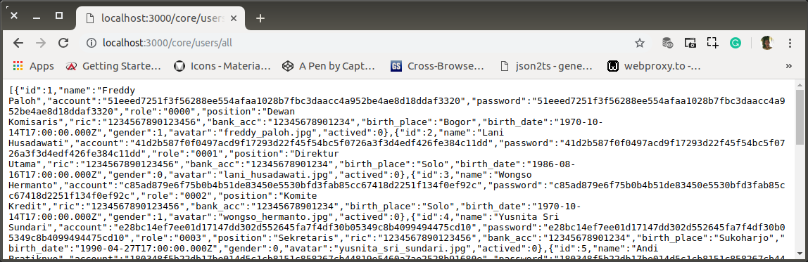
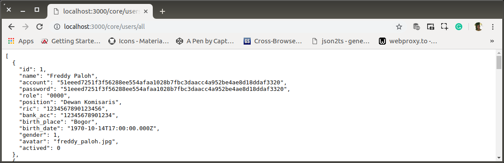
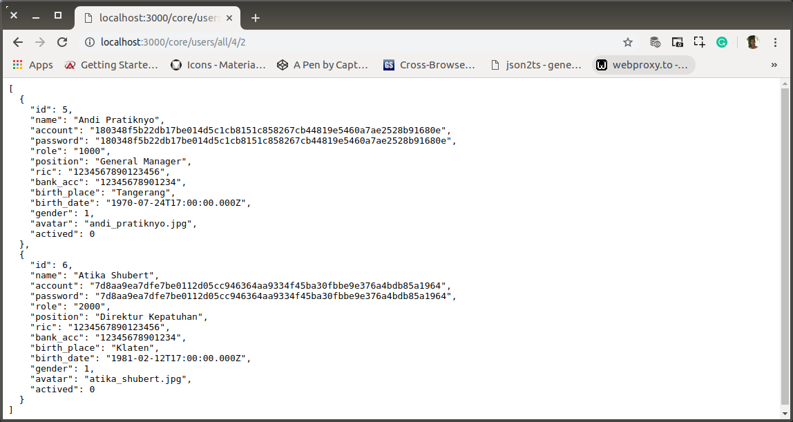
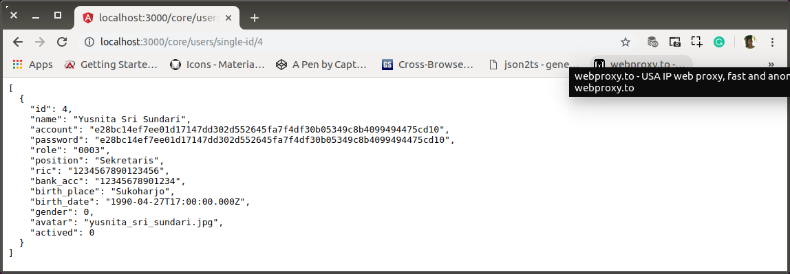

# af-02-users-get-users.md

`Sabtu, 20 Juli 2019`

**`09:58`**

Semua hal yang terkait dengan `users` akan berada di dalam `routes/core/users`. 

Berikut akan dibuat base-point route untuk `users` beserta middleware untuk menayangkan semua data users. Termasuk data yang terkait dengannya.

**`05:13`**

**`08:59`**

## Routes

0. Base-point

    ```bash
    $ # app-root
    $ mkdir routes/core/users && touch routes/core/users/index.js
    ```

    ```javascript
    'use-strict';

    var users = require('express').Router();

    users.get('/', (req, res) => {
        res.sendFile(staticBase + '/routes.html');
    });

    module.exports = users;
    ```

1. Register

    `/routes/core/index.js`

    ```javascript
    'use-strict';

    var core = require('express').Router(),
        users = require('./users');

    core.use('/users', users);

    core.get('/', (req, res) => {
        res.sendFile(staticBase + '/routes.html');
    });

    module.exports = core;
    ```

## Middleware Tasks

Karena middleware akan dibangun sesuai dengan kebutuhan aplikasi frontend, paling tidak yang harus tersedia saat ini adalah:

**`GET`**
- All rows, all columns
    ```sql
    SELECT u.id, u.name, u.account, u.password, u.role, r.name AS position, u.ric, u.bank_acc, u.birth_place, u.birth_date, gender, a.photo AS avatar, a.actived
    FROM bpr.users AS u
    JOIN bpr.roles AS r
    JOIN bpr.avatars AS a
    ON u.role=r.code
    AND u.id=a.user;
    ```
- All Rows, all columns, LIMIT fromAfter-asManyAs 
    ```sql
    SELECT u.id, u.name, u.account, u.password, u.role, r.name AS position, u.ric, u.bank_acc, u.birth_place, u.birth_date, gender, a.photo AS avatar, a.actived
    FROM bpr.users AS u
    JOIN bpr.roles AS r
    JOIN bpr.avatars AS a
    ON u.role=r.code
    AND u.id=a.user
    ORDER BY u.id
    LIMIT fromAfter,asManyAs;
    ```

- Single row, all columns
    ```sql
    SELECT u.id, u.name, u.account, u.password, u.role, r.name AS position, u.ric, u.bank_acc, u.birth_place, u.birth_date, gender, a.photo AS avatar, a.actived
    FROM bpr.users AS u
    JOIN bpr.roles AS r
    JOIN bpr.avatars AS a
    ON u.role=r.code
    AND u.id=a.user
    WHERE u.id=userId
    ```

## Middleware: All rows, all colums

0. Build

    ```bash
    $ # app-root
    $ touch routes/core/users/all.js
    ```
    
    `/routes/core/users/all.js`

    ```javascript
    'use-strict';

    var db = require('../../../connection'),
        beautify = require("json-beautify");

    module.exports = (req, res) => {
        query = 'SELECT ' +
                'u.id, u.name, u.account, u.password, u.role, r.name AS position, ' +
                'u.ric, u.bank_acc, u.birth_place, u.birth_date, gender, ' +
                'a.photo AS avatar, a.actived ' +
                'FROM bpr.users AS u ' +
                'JOIN bpr.roles AS r ' +
                'JOIN bpr.avatars AS a ' +
                'ON u.role = r.code ' +
                'AND u.id = a.user;';
        db.query(
            query, function (error, rows, fields) {
                if (error) {
                    console.log(error);
                } else {
                    res.header("Content-Type", 'application/json');
                    res.send(beautify(rows, null, 2, 50));
                }
            }
        );
    };
    ```

1. Register

    `/routes/core/users/index.js`

    ```javascript
    'use-strict';

    var db = require('../../../connection');

    module.exports = (req, res) => {
        db.query(
            'SELECT * FROM users', function (error, rows, fields) {
                if (error) {
                    console.log(error);
                } else {
                    res.send(rows);
                }
            }
        );
    };
    ```

2. Test

    <p align="center">
        
        <br />Figure: af-02-a-users-all.png
    </p>

3. JSON Beautify

    Hasilnya tidak enak dibaca. Mencoba `json-beautify`, https://www.npmjs.com/package/json-beautify

    ```bash
    $ # project-root
    $ sudo chown wandyatmono:wandyatmono node_modules/ -R
    $ npm install json-beautify --save
    ```

    JSON.stringify with fixed maximum character width.

    json-beautify is a fork of JSON.stringify json2.js implementation.

    It has the exact same signature of JSON.stringify but it also adds an optional 4th parameter:

    `JSON.stringify(value[, replacer[, space]])`
    `jsonBeautify(value[, replacer[, space[, max-width]]])`

    The maximum fixed character width (for instance 80).

    `/routes/core/users/index.js`

    ```javascript
    'use-strict';

    var db = require('../../../connection'),
        beautify = require("json-beautify");

    module.exports = (req, res) => {
        db.query(
            'SELECT * FROM users', function (error, rows, fields) {
                if (error) {
                    console.log(error);
                } else {
                    res.header("Content-Type", 'application/json');
                    res.send(beautify(rows, null, 2, 50));
                }
            }
        );
    };
    ```

4. Test

    <p align="center">
        
        <br />Figure: af-02-b-users-all-beautify.png
    </p>

## Middleware: All Rows, all columns, LIMIT fromAfter-asManyAs

0. Build

    ```bash
    $ # app-root
    $ touch routes/core/users/all-pagination.js
    ```

    `/routes/core/users/all-pagination.js`

    ```javascript
    'use-strict';

    var db = require('../../../connection'),
        beautify = require("json-beautify");

    module.exports = (req, res) => {
        query = 'SELECT ' +
            'u.id, u.name, u.account, u.password, u.role, r.name AS position, ' +
            'u.ric, u.bank_acc, u.birth_place, u.birth_date, gender, ' +
            'a.photo AS avatar, a.actived ' +
            'FROM bpr.users AS u ' +
            'JOIN bpr.roles AS r ' +
            'JOIN bpr.avatars AS a ' +
            'ON u.role = r.code ' +
            'AND u.id = a.user ' +
            'ORDER BY u.id ' +
            'LIMIT ' + req.params.fromAfter + ',' + req.params.asManyAs;
        db.query(
            query, function (error, rows, fields) {
                if (error) {
                    console.log(error);
                } else {
                    res.header("Content-Type", 'application/json');
                    res.send(beautify(rows, null, 2, 50));
                }
            }
        );
    };
    ```

1. Register

    `/routes/core/users/index.js`

    ```javascript
    'use-strict';

    var users = require('express').Router(),
        all = require('./all.js'),
        allLimit = require('./all-pagination');

    users.get('/all/:fromAfter/:asManyAs', allLimit);

    users.get('/all', all);

    users.get('/', (req, res) => {
        res.sendFile(staticBase + '/routes.html');
    });

    module.exports = users;
    ```

2. Test

    <p align="center">
        
        <br />Figure: af-02-c-users-all-pagination.png
    </p>

## Middleware: Single row, all columns

0. Build

    ```bash
    $ # app-root
    $ touch routes/core/users/single-id.js
    ```

    `/routes/core/users/single-id.js`

    ```javascript
    'use-strict';

    var db = require('../../../connection'),
        beautify = require("json-beautify");

    module.exports = (req, res) => {
        query = 'SELECT ' +
            'u.id, u.name, u.account, u.password, u.role, r.name AS position, ' +
            'u.ric, u.bank_acc, u.birth_place, u.birth_date, gender, ' +
            'a.photo AS avatar, a.actived ' +
            'FROM bpr.users AS u ' +
            'JOIN bpr.roles AS r ' +
            'JOIN bpr.avatars AS a ' +
            'ON u.role = r.code ' +
            'AND u.id = a.user ' +
            'WHERE u.id = ' + req.params.id + ';';
        db.query(
            query, function (error, rows, fields) {
                if (error) {
                    console.log(error);
                } else {
                    res.header("Content-Type", 'application/json');
                    res.send(beautify(rows, null, 2, 50));
                }
            }
        );
    };
    ```

1. Register

    `/routes/core/users/index.js`

    ```javascript
    'use-strict';

    var users = require('express').Router(),
        all = require('./all.js'),
        allLimit = require('./all-pagination'),
        singleId = require('./single-id.js');

    users.get('/single-id/:id', singleId);

    users.get('/all/:fromAfter/:asManyAs', allLimit);

    users.get('/all', all);

    users.get('/', (req, res) => {
        res.sendFile(staticBase + '/routes.html');
    });

    module.exports = users;
    ```

2. Test

    <p align="center">
        
        <br />Figure: af-02-d-users-single-id.png
    </p>

**`16:41`**